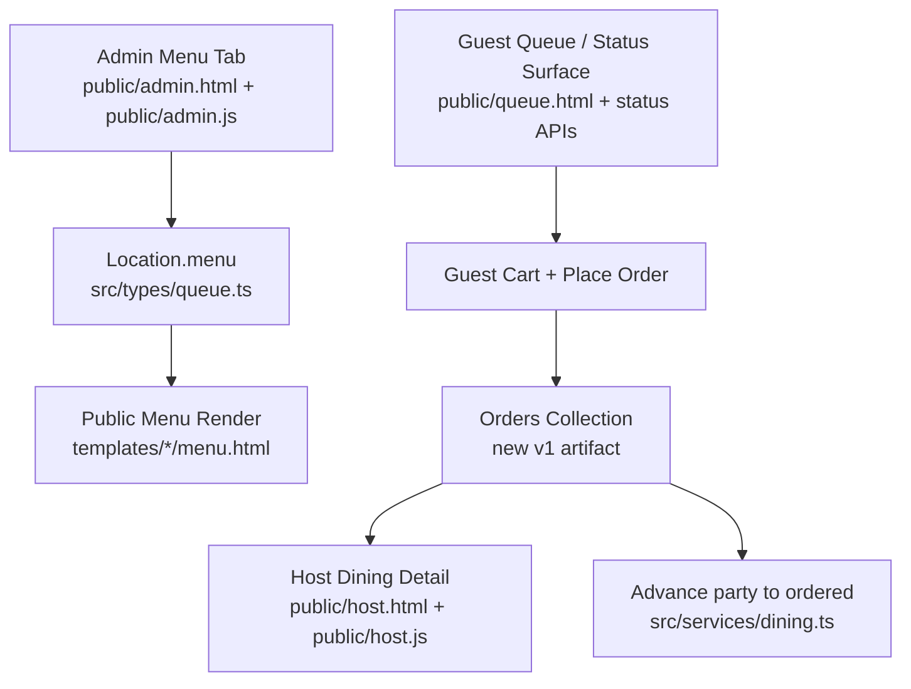

# Feature: Rich Guest Menu Ordering

Issue: [#11](https://github.com/mathursrus/SKB/issues/11)
Owner: Codex (agent)
Related specs: [#24 dining party lifecycle](./24-dining-party-lifecycle.md), [#46 separate admin view from host view](../rfcs/46-separate-admin-view-from-host-view.md), [#51 fully multi-tenant system](./51-fully-multi-tenant-system.md)
Related mocks:
- [`mocks/11-admin-rich-menu-builder.html`](./mocks/11-admin-rich-menu-builder.html)
- [`mocks/11-guest-ordering.html`](./mocks/11-guest-ordering.html)
- [`mocks/11-host-party-order-detail.html`](./mocks/11-host-party-order-detail.html)

## Customer

The customer is a two-sided operational pair:

- The **restaurant owner/admin** who needs the menu in Admin to feel like a real product surface instead of a text-only list.
- The **guest + host pair** who need ordering to happen faster once a party is seated, without introducing tablets at the table, payment terminals, or POS integration.

## Customer's Desired Outcome

- **Owner/admin**: "I can make each dish feel real: add a photo, show what comes with it, and define what guests can optionally add."
- **Guest**: "I can build my order from my phone with quantity, notes, and optional add-ons, without waiting for someone to come take it down."
- **Host**: "When a seated party submits from their phone, I can immediately see that they have ordered, open that party, and read the exact order details."

## Customer Problem being solved

The repository already has the foundations of a menu system, but not a usable ordering experience:

1. **Admin menu authoring is too flat**. The current builder only captures section title, item name, optional description, and optional price. A dish cannot carry a photo, required ingredient list, or guest-selectable options.
2. **The guest menu is read-only**. Public menu rendering shows a text list, but there is no cart, no quantity selector, no notes field, and no way for an active party to turn menu intent into an order.
3. **The host loses the order artifact**. The dining lifecycle already distinguishes `seated` from `ordered`, but today "ordered" is only a manual host tap. There is no order document to inspect after a guest submits.
4. **Seat-to-order time is still wasted time**. Even with the dining lifecycle work from issue #24, the first 5 to 10 minutes after seating are still usually spent on menu browsing and order capture instead of food progress.

This feature uses the existing menu builder and dining lifecycle as the base, then adds the missing primitives needed to turn "looking at the menu" into "a real order the host can act on."

## User Experience that will solve the problem

### Intent statement

Issue #11 started life as "pre-order while waiting." In the codebase as it exists today, the cleanest v1 is a **unified guest ordering surface**: guests can browse and build their cart as soon as they join, but the actual **Place order** action becomes available once the party is in `seated` state. That preserves the current lifecycle semantics while still cutting seat-to-order time to near-zero.

### Current system touchpoints

### Admin flow - richer menu authoring in the existing Menu tab

The Menu tab in `admin.html` remains the canonical place to author dishes. The change is that each menu item stops being a three-field row and becomes an expandable dish editor with these fields:

- **Photo**: one hero image per dish.
- **Name**
- **Description**
- **Base price**
- **Required ingredients**: display-only list shown to guests as "comes with".
- **Optional ingredients / add-ons**: guest-selectable chips or checkboxes; each option may carry an optional price delta.
- **Availability toggle**: available / unavailable for order without deleting the dish.

The admin still works section-first (`Dosas`, `Uthappam`, `Beverages`, etc.), but each item now previews as a compact card so the owner can see whether the menu reads well visually before saving.

### Guest flow - one ordering UI for active parties

The guest experience is attached to the existing active-party journey, not to a separate anonymous storefront.

1. A diner joins the queue as they do today.
2. On the guest status experience, a new **Order** entry point appears alongside the existing queue/status content.
3. The guest sees dish cards with:
   - photo
   - name
   - base price
   - short description
   - required ingredients summary
4. Tapping a dish opens a bottom sheet on mobile (or side panel on wide screens) with:
   - larger photo
   - required ingredients
   - optional ingredient selectors
   - notes textarea
   - quantity stepper
   - **Add to cart**
5. The guest can build and edit a cart while in `waiting`, `called`, or `seated`.
6. While the party is still `waiting` or `called`, the primary CTA reads: **Cart saved - submit after seating**. The cart is editable, but not placeable.
7. Once the party becomes `seated`, the CTA upgrades to **Place order**.
8. On successful submission:
   - the cart becomes a placed order
   - the party state automatically advances from `seated` to `ordered`
   - the guest sees a confirmation state with the submitted items, notes, and submitted timestamp

This gives the guest something meaningful to do while waiting, but keeps the authoritative "ordered" transition tied to a seated party, which matches the existing host flow and analytics.

### Host flow - order-aware seated-party detail

The host's Seated tab remains the command center for active tables, but row click behavior becomes more useful than a timeline-only expansion.

1. A party in `seated` state with no submitted order looks the same as today, except the row detail now has an **Order** section that says "No guest order yet."
2. When a seated guest places their order:
   - the row state changes to `ordered`
   - the row shows an **Order placed** signal
   - clicking the row opens a detail panel (or inline expansion on smaller screens) that combines:
     - party metadata
     - lifecycle timeline
     - submitted order summary
     - line items with quantity, chosen optional ingredients, and notes
3. The host's next lifecycle action remains **Served** from the `ordered` state. This feature does not change the downstream buttons from issue #24.

### Out of scope for this v1

- No payment capture
- No tip flow
- No kitchen display system
- No POS integration
- No multiple guest-submitted order rounds after the first placed order
- No anonymous public ordering for users who are not an active queue/dining party

### UI mocks

- [`docs/feature-specs/mocks/11-admin-rich-menu-builder.html`](./mocks/11-admin-rich-menu-builder.html) - richer admin menu authoring with photo upload, required ingredients, and optional add-ons
- [`docs/feature-specs/mocks/11-guest-ordering.html`](./mocks/11-guest-ordering.html) - mobile-first guest menu, dish detail sheet, cart, and seated-only submit flow
- [`docs/feature-specs/mocks/11-host-party-order-detail.html`](./mocks/11-host-party-order-detail.html) - host Seated tab with order-aware row detail

### Design Standards Applied

No project-specific design system is configured in FRAIM, so these mocks use the **generic UI baseline** while staying visually sympathetic to the repo's existing surfaces:

- same warm neutral background family already used by host/admin
- mobile-first primary flow for guests in portrait orientation
- compact cards and controls with stable layout
- no decorative preview framing around the primary ordering flow
- button and card radius kept within the repo's current UI language

## Functional Requirements (traceable)

| ID | Requirement |
|---|---|
| R1 | System SHALL extend the structured menu item model to support one image, one availability flag, a required-ingredients list, and an optional-ingredients list per menu item. |
| R2 | Admin/owner users SHALL author the richer dish fields inside the existing Admin > Menu tab rather than in a separate tool. |
| R3 | Host-role PIN sessions SHALL NOT be allowed to edit the structured menu. |
| R4 | Guest-facing menu rendering SHALL display dish photo, name, description, price, and required ingredients when present. |
| R5 | System SHALL expose a cart to an active party in `waiting`, `called`, or `seated` state. |
| R6 | Guest cart lines SHALL capture quantity, selected optional ingredients, and a freeform note per line item. |
| R7 | System SHALL persist an editable draft cart for the active party before order placement. |
| R8 | System SHALL prevent final order submission while the party state is `waiting` or `called`. |
| R9 | System SHALL allow final order submission while the party state is `seated`. |
| R10 | System SHALL create a persisted order record tied to the party record, location, and service day at submission time. |
| R11 | Each placed order line SHALL snapshot the dish name, base price, selected optional ingredients, quantity, note, and menu item id at the time of submission. |
| R12 | When a seated party successfully submits their first guest order, the system SHALL advance the party state from `seated` to `ordered` and set `orderedAt` server-side. |
| R13 | If the party has already reached `ordered`, `served`, `checkout`, `departed`, or `no_show`, the guest ordering surface SHALL become read-only and SHALL NOT accept a new submission in v1. |
| R14 | Host Seated-tab rows SHALL visibly indicate when a party has a placed guest order. |
| R15 | Clicking a dining row in the host view SHALL reveal the order contents alongside the party timeline. |
| R16 | The host order detail SHALL show quantity, chosen optional ingredients, notes, and submitted timestamp for each line item. |
| R17 | Parties without a placed order SHALL show an explicit empty state in the host detail view rather than a blank panel. |
| R18 | Dish image uploads SHALL be validated as image files and stored in the same tenant-safe asset pattern already used for website dish images. |
| R19 | Freeform guest notes SHALL be treated as untrusted input and SHALL be escaped/sanitized before rendering in host and guest UIs. |
| R20 | The feature SHALL remain mobile-usable on a phone-width viewport in portrait orientation for the guest flow. |
| R21 | The feature SHALL NOT collect payment credentials or trigger card capture in v1. |
| R22 | The feature SHALL preserve tenant scoping for both menu reads/writes and order reads/writes. |
| R23 | The existing public read endpoint for menu data SHALL continue to work for non-ordering menu rendering. |
| R24 | The existing host lifecycle controls after `ordered` (`Served`, `Checkout`, `Departed`) SHALL remain intact. |

## Acceptance Criteria

- **AC-R1/R2**: *Given* an admin in the Menu tab, *when* they expand a dish editor, *then* they can set photo, required ingredients, optional ingredients, and availability without leaving the Menu workspace.
- **AC-R4**: *Given* a menu item with photo, description, and required ingredients, *when* a guest opens the ordering UI, *then* those fields render on the dish card or detail sheet.
- **AC-R5/R7**: *Given* a party in `waiting` state, *when* the guest adds two items with notes to their cart, *then* the cart persists and remains editable on refresh.
- **AC-R8**: *Given* a party in `called` state, *when* the guest opens the cart, *then* the submit button is disabled and the UI explains that submission unlocks after seating.
- **AC-R9/R10/R12**: *Given* a party in `seated` state with a valid cart, *when* the guest taps **Place order**, *then* an order record is created, the party becomes `ordered`, and `orderedAt` is populated.
- **AC-R11**: *Given* an optional ingredient price changes later in Admin, *when* the host opens a previously placed order, *then* the order still shows the submitted option snapshot rather than recalculating from the new menu.
- **AC-R13**: *Given* a party already in `ordered` state, *when* the guest revisits the ordering surface, *then* they see their submitted order in read-only mode and cannot place a second guest order in v1.
- **AC-R14/R15/R16**: *Given* a seated party has just placed an order, *when* the host opens that party from the Seated tab, *then* the detail view shows the submitted line items, quantities, chosen options, notes, and timestamp.
- **AC-R17**: *Given* a seated party has not yet ordered, *when* the host opens the row detail, *then* the order section reads "No guest order yet" with no missing or broken layout.
- **AC-R18/R19**: *Given* an admin uploads a non-image file or a guest enters HTML in notes, *when* the server processes the request, *then* the upload is rejected or the note is safely escaped rather than executed.

## Error States

- **Menu item unavailable**: If an item is marked unavailable after a guest added it to cart but before submit, the submission is rejected with a per-line error and the guest is prompted to remove or replace it.
- **Party not seated yet**: The guest can still edit draft contents, but submission returns a clear "Place order after seating" response.
- **Party already beyond ordering**: Submission is rejected and the guest sees the read-only order summary.
- **Lost party context**: If the guest no longer has a valid active party code/session, the ordering surface falls back to read-only public menu browsing.
- **Image upload failure**: Admin sees a field-level error and the unsaved dish editor state is preserved.
- **Concurrent placement**: If the guest taps Place order twice, the second request resolves to the already-created order rather than creating duplicates.
- **Host open detail without order**: The detail panel still renders lifecycle/timeline data and an explicit empty order state.

## Compliance Requirements (if applicable)

No formal compliance framework is configured in FRAIM for this repo, so these requirements are **inferred from project context and the operational risk of restaurant guest ordering**.

- **CR1 - Payment exclusion**: v1 SHALL not collect or store cardholder data, which keeps the feature outside PCI payment-processing scope.
- **CR2 - Tenant scoping**: Order and menu write operations SHALL remain location-scoped and protected by the same host/admin session model already used by the repo.
- **CR3 - PII minimization**: The order record SHALL reference the existing party identity rather than duplicating phone number or new guest profile data.
- **CR4 - Untrusted text safety**: Guest notes and admin-authored ingredient text SHALL be escaped before rendering to prevent stored XSS in host/admin/guest surfaces.
- **CR5 - Allergen clarity**: Required and optional ingredient lists SHALL be presented as informational menu content only. The UI SHALL NOT imply medical allergen safety guarantees.
- **CR6 - Media upload safety**: Dish photo uploads SHALL accept image MIME types only and SHALL reuse the repo's tenant-safe asset storage pathing.

## Validation Plan

- **Manual browser validation**
  - Admin: add a dish photo, required ingredients, and two optional add-ons; save; reload; verify persistence.
  - Guest: join the queue, open the order surface, build a cart while waiting, verify submit is disabled, then seat the party and verify submit becomes available.
  - Host: after guest submit, refresh the Seated tab and verify the party is in `ordered` state and row detail shows the order.
- **API/integration validation**
  - menu read/write contract tests for richer item schema
  - order draft creation/update tests tied to active party state
  - placed-order submission test that also verifies `orderedAt` and state advancement
  - duplicate-submit/idempotency test
  - unavailable-item rejection test
- **Regression validation**
  - existing `api/menu` read path still renders public menus
  - existing host lifecycle actions still work from `ordered` onward
  - existing waitlist join / seat flow remains green per project rule 7
- **Compliance validation**
  - verify no payment fields exist in order payloads or persisted records
  - verify host/admin authorization boundaries on new endpoints
  - verify guest notes render escaped in host detail
  - verify non-image uploads are rejected

## Alternatives

| Alternative | Why discard? |
|---|---|
| Keep the current text-only menu and add a separate `menu_items` collection for ordering | The repo already has `Location.menu` as the canonical structured menu. Forking the source of truth would create sync problems immediately. |
| Allow guests to fully submit orders while still `waiting` | That creates lifecycle ambiguity because the existing operational meaning of `ordered` assumes a seated party. Draft-while-waiting plus submit-when-seated keeps the model coherent. |
| Require the host to manually confirm every guest-submitted order before state changes | Adds another bottleneck and defeats the point of shrinking seat-to-order time. |
| Put the order only on the waiting row and not in the seated-party detail | The host's active operational view is the Seated tab. Hiding the submitted order there would force context switching. |
| Add payments in the same release | Increases scope and compliance burden sharply while not being necessary to solve the speed-to-order problem. |

## Competitive Analysis

### Configured Competitors Analysis

No competitors are configured in FRAIM for this project.

### Additional Competitors Analysis

| Competitor | Current Solution | Strengths | Weaknesses | Customer Feedback | Market Position |
|---|---|---|---|---|---|
| Waitwhile | Waitwhile positions itself as a restaurant waitlist and reservation system with SMS notifications and a broader customer-journey platform | Strong waitlist, communication, and operational admin coverage | Does not center its story on guest-controlled dine-in ordering from the active party object | Public materials emphasize wait-time reduction and queue management more than ordering detail | Broad queue-management platform used across industries |
| Waitlist Me | Waitlist Me positions itself as a simple restaurant waitlist/reservations product with public waitlist pages and text paging | Close substitute for SKB's current waitlist use case; no-app customer flow | Focus remains on waitlist visibility and paging, not rich dish configuration or host-visible placed orders | Public materials emphasize simplicity and no-app guest access | Focused waitlist/reservation specialist |
| TablesReady | TablesReady positions itself as an all-in-one restaurant waitlist, reservations, SMS paging, and table-management tool | Strong host-stand operational story for walk-ins and reservations on one screen | Still organized around host-side queue/table operations rather than guest-owned menu/order detail | Public materials emphasize ease of use and reduced host-stand chaos | Restaurant-specific waitlist and reservations vendor |
| BentoBox Ordering | BentoBox positions dine-in ordering and QR Order & Pay inside its restaurant commerce suite | Strong branded menu presentation and guest phone ordering | More website/commerce-led than queue-lifecycle-led; includes payment complexity that SKB is avoiding in v1 | Public materials emphasize branded menus, mobile ordering, and QR ordering speed | Premium restaurant website + commerce vendor |
| Popmenu | Popmenu positions direct online ordering, menu photos/videos, and restaurant growth tooling in one platform | Strong menu merchandising and direct-ordering presentation | More revenue/marketing oriented than seated-party operational state tracking | Public materials emphasize restaurant growth, menu merchandising, and first-party ordering | Restaurant marketing + ordering platform |

### Competitive Positioning Strategy

#### Our Differentiation

- **Key Advantage 1**: The ordering surface is attached to the same live party object that already powers queue, seating, and host operations.
- **Key Advantage 2**: Guests can prepare the cart while waiting without forcing the product to treat a not-yet-seated party as operationally ordered.
- **Key Advantage 3**: The host gets a concrete order artifact inside the same seated-party detail view they already use for lifecycle management.

#### Competitive Response Strategy

- **If Toast or Square win on integrated payments**: stay focused on speed-to-order and host workflow, not payment capture.
- **If online-ordering vendors add waitlist pages**: emphasize that SKB's ordering is anchored to an active in-house party lifecycle, not a generic storefront.
- **If guest-management vendors add prettier menu cards**: emphasize the end-to-end operational link between admin menu authoring, guest submit, and host detail.

#### Market Positioning

- **Target Segment**: single-location or small-group restaurants with meaningful dine-in wait times and no appetite for a full POS replacement
- **Value Proposition**: "Let guests build the order on their phone, then turn that into a real host-visible order the moment they're seated."
- **Pricing Strategy**: include it as part of the waitlist/host product rather than a separate ordering add-on

### Research Sources

- Waitwhile restaurant waitlist product pages and help center
- Waitlist Me restaurant waitlist and public waitlist pages
- TablesReady restaurant waitlist and walk-ins/reservations pages
- BentoBox dine-in ordering, online ordering, and DinePay pages
- Popmenu online ordering and owners app/product pages
- Research date: 2026-04-20
- Research methodology: current web review of official product pages focused on guest phone ordering, QR ordering, menu presentation, and restaurant workflow positioning

## v1 Assumptions

1. There is exactly one guest-submitted placed order per party in v1.
2. Guests may edit draft cart contents until submission, but not after submission.
3. Host remains the actor who advances the lifecycle after `ordered`.
4. Menu photos reuse the existing tenant asset-storage approach rather than introducing a new media service.
5. Kitchen routing is deferred; the host detail panel is the first operational sink for the submitted order.

## Open Questions

- Should optional ingredients support only boolean include/exclude selection in v1, or also quantity and price deltas per option?
- Should guests be allowed to delete their entire draft cart after being seated, or only edit line items?
- Should a host be able to manually override the guest-submitted order after placement, or remain read-only in v1?
- When a party is seated and already has a prepared draft cart, should the guest receive an explicit nudge that submission is now unlocked?
