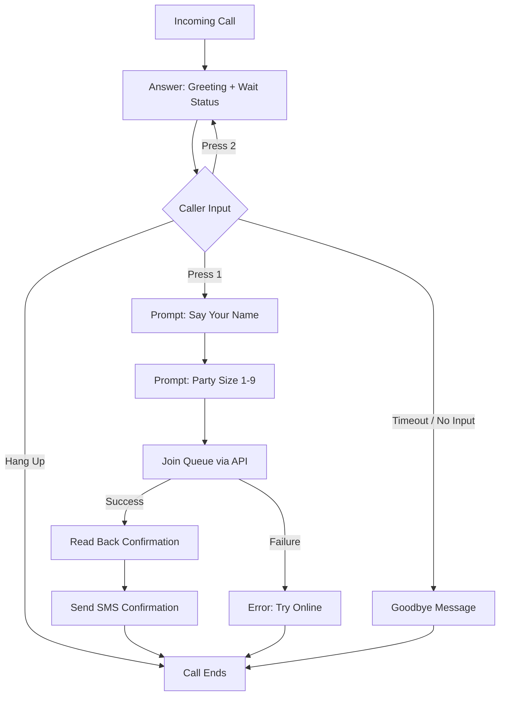

# Feature: Phone System Integration of Wait List

Issue: #31
Owner: Claude (AI Employee)

## Customer

**Diners** who prefer to call rather than use a website, including those who are less tech-savvy, driving, or simply find a phone call more convenient. **Restaurant hosts** who want to capture walk-up and call-in demand without requiring every customer to use a smartphone web app.

## Customer's Desired Outcome

A diner calls the SKB phone number and hears a friendly automated system that tells them how many parties are waiting and how long the wait is. If they want to join, they provide their name and party size over the phone, get added to the waitlist automatically, and receive an SMS confirmation with their pickup code and status link — the same experience as joining online.

## Customer Problem Being Solved

Today, joining the waitlist requires navigating to the SKB web page on a smartphone. This creates friction for several customer segments:

1. **Non-smartphone users** — older diners or those without mobile data cannot join the waitlist at all.
2. **Drivers en route** — diners driving to the restaurant cannot safely browse to a website.
3. **Phone-first preference** — some customers instinctively call a restaurant to ask about wait times rather than looking up a website.
4. **Walk-up inquiries** — potential diners who call to ask "how long is the wait?" have no way to act on the answer without switching to the web.
5. **Missed demand** — the restaurant has no way to capture and convert phone inquiries into waitlist entries.

## User Experience That Will Solve the Problem

### Caller Flow (Check Wait & Join)

1. Diner calls the SKB phone number (the same Twilio number used for SMS, or a dedicated voice number per location).
2. System answers within 2 rings with:
   > *"Hello, and thank you for calling Shri Krishna Bhavan! There are currently 5 parties ahead of you, with an estimated wait of about 40 minutes."*
3. System offers a choice:
   > *"To add your name to the waitlist, press 1. To hear the wait time again, press 2. Or hang up at any time."*
4. **If caller presses 1** (Join):
   a. System prompts for name:
      > *"Please say your name after the beep."*
   b. System captures name via Twilio speech recognition (or recording with transcription fallback).
   c. System prompts for party size:
      > *"How many guests in your party? Press a number on your keypad from 1 to 9."*
   d. System captures party size via DTMF keypress.
   e. System uses the caller's phone number from Caller ID — no manual phone entry needed.
   f. System calls the existing `joinQueue()` service function with `{ name, partySize, phone }`.
   g. System reads back the confirmation:
      > *"You're all set! You are number 6 in line. Your estimated wait is about 48 minutes. Your pickup code is S-K-B dash 7-Q-3. We'll send you a text message with your code and a link to track your place in line. Thank you for calling!"*
   h. System sends the standard SMS join confirmation (reusing `joinConfirmationMessage` template).
   i. Call ends.
5. **If caller presses 2** (Repeat):
   - System repeats the current waitlist status and returns to the menu.
6. **If caller doesn't press anything** (Timeout / Hang up):
   > *"Thank you for calling Shri Krishna Bhavan. Goodbye!"*
   - Call ends.

### Caller Flow (Queue Full or Restaurant Closed)

1. If the restaurant has no active queue (e.g., closed or not accepting new entries):
   > *"Thank you for calling Shri Krishna Bhavan. We're not currently accepting waitlist entries. Please try again during our business hours. Goodbye!"*

### Error Handling Flows

1. **Speech recognition fails for name**:
   > *"Sorry, I didn't catch that. Please say your name again after the beep."*
   - After 2 failed attempts:
   > *"We're having trouble hearing you. Please try joining our waitlist online instead. Goodbye!"*

2. **Invalid party size (0, or non-digit)**:
   > *"Please press a number between 1 and 9 on your keypad."*
   - After 2 failed attempts, same online fallback message.

3. **Join service error** (database down, code collision exhausted):
   > *"We're sorry, we're experiencing a technical issue. Please try joining our waitlist online or call back in a few minutes. Goodbye!"*

### Host Flow

No changes to the host dashboard. Parties who join via phone appear identically to parties who join via the web — same queue entry, same SMS confirmation, same call/seat/remove workflow. The host cannot distinguish between web and phone joiners (and doesn't need to).

### IVR Call Flow Diagram

### UI Mocks

This feature is voice-only — no visual UI changes are needed for the diner or host interfaces. However, a mock of the IVR call flow and the TwiML webhook structure is provided:

- [IVR Call Flow Visualization](mocks/31-ivr-call-flow.html)

### Design Standards

No visual design standards apply (voice-only feature). The SMS confirmation reuses the existing SKB SMS templates and branding established in Issue #29.

Voice tone guidelines:
- **Warm and welcoming**: "Hello, and thank you for calling..."
- **Clear and concise**: No unnecessary filler. State facts, offer choices, confirm actions.
- **Spelled-out codes**: Pickup codes are read character-by-character with pauses (e.g., "S-K-B dash 7-Q-3").

## Requirements

| Tag | Requirement | Acceptance Criteria |
|-----|------------|---------------------|
| R1 | The system SHALL expose a Twilio Voice webhook endpoint at `POST /r/:loc/api/voice/incoming` that returns TwiML to handle incoming calls. | Given an incoming call to the Twilio number configured for location "skb", When Twilio hits the webhook, Then a valid TwiML response is returned within 2 seconds. |
| R2 | The IVR greeting SHALL announce the current number of parties waiting and the estimated wait time for a new party. | Given 5 parties waiting with avgTurnTime=8min, When the caller hears the greeting, Then the message says "There are currently 5 parties ahead of you, with an estimated wait of about 48 minutes." |
| R3 | The IVR SHALL offer callers the option to join the waitlist by pressing 1. | Given the caller hears the greeting, When they press 1 on their keypad, Then the system proceeds to collect their name. |
| R4 | The IVR SHALL collect the caller's name via Twilio speech recognition (`<Gather input="speech">`). | Given the caller presses 1, When prompted "Please say your name after the beep", Then the system captures their spoken name via speech-to-text. |
| R5 | The IVR SHALL collect the party size via DTMF keypress (`<Gather input="dtmf" numDigits="1">`). | Given the caller has provided their name, When prompted for party size, Then they press a digit 1-9 and the system captures it. |
| R6 | The system SHALL use the caller's phone number (Caller ID / `req.body.From`) as the contact phone number. | Given an incoming call from +12065551234, When the caller joins the waitlist, Then the phone field is set to "2065551234" (stripped of +1 prefix). |
| R7 | The system SHALL call the existing `joinQueue()` function to add the caller to the waitlist. | Given valid name, partySize, and phone, When the join is processed, Then the same queue entry is created as a web join — same code, position, ETA, and state. |
| R8 | The IVR SHALL read back the position, estimated wait time, and pickup code (spelled out) after a successful join. | Given a successful join at position 6 with ETA 48 min and code SKB-7Q3, When the confirmation plays, Then the caller hears "You are number 6 in line. Your estimated wait is about 48 minutes. Your pickup code is S-K-B dash 7-Q-3." |
| R9 | The system SHALL send the standard SMS join confirmation after a successful phone join. | Given a successful phone join, When the confirmation is sent, Then the diner receives the same SMS as web joiners: "SKB: You're on the list! Track your place in line here: {STATUS_URL}. Code: {CODE}" |
| R10 | The IVR SHALL allow callers to press 2 to hear the waitlist status again. | Given the caller is at the main menu, When they press 2, Then the current wait status is repeated and the menu is offered again. |
| R11 | The IVR SHALL handle timeout (no input) gracefully with a goodbye message. | Given the caller doesn't press anything for 10 seconds, When the timeout fires, Then the system says "Thank you for calling... Goodbye!" and hangs up. |
| R12 | The IVR SHALL retry name capture up to 2 times on speech recognition failure before falling back to an online suggestion. | Given the speech recognizer returns empty/no result, When the first attempt fails, Then the system asks again. After 2 failures, it says "Please try joining online." |
| R13 | The IVR SHALL validate party size is between 1 and 9. | Given the caller presses 0 or a non-digit, When the input is invalid, Then the system re-prompts: "Please press a number between 1 and 9." |
| R14 | The voice webhook endpoint SHALL support multi-tenant routing via the `:loc` URL parameter. | Given Twilio is configured to hit `/r/skb/api/voice/incoming`, When a call arrives, Then the "skb" location queue is used. Given `/r/skb-demo/api/voice/incoming`, Then the "skb-demo" queue is used. |
| R15 | Voice/IVR failures SHALL NOT affect the existing web-based waitlist or SMS functionality. | Given the voice webhook throws an error, When a web user joins via the website, Then the web flow works normally with no degradation. |
| R16 | The system SHALL add a `TWILIO_VOICE_ENABLED` environment variable (default: false) to enable/disable the voice feature. | Given `TWILIO_VOICE_ENABLED` is not set or false, When the server starts, Then the voice webhook route is not registered. |

### Edge Cases

- **Blocked Caller ID**: If the caller's number is anonymous/restricted (`From` is empty or "Anonymous"), the system SHALL inform the caller: *"We need your phone number to send you a text confirmation. Unfortunately, your number appears blocked. Please try joining online instead."* and end the call.
- **Party size > 9**: The DTMF gather is limited to 1 digit (1-9). Parties of 10 are not supported via phone (web max is 10). System can suggest calling the restaurant directly for large parties.
- **Concurrent callers**: Each call is an independent Twilio webhook request. The existing `joinQueue()` handles concurrent writes safely (unique code retry loop).
- **Caller hangs up mid-flow**: Twilio handles this natively. No cleanup needed — no queue entry is created until the join step completes.
- **Database unavailable during status check**: If `getQueueState()` fails, the IVR SHALL say: *"We're sorry, we can't retrieve the current wait time. Please try again in a moment."* and end the call.
- **SMS confirmation fails after phone join**: Same as web behavior — join succeeds, SMS failure is logged, not blocking. The verbal confirmation already gave the caller their code.

## Compliance Requirements

> No formal compliance frameworks (SOC2, HIPAA, etc.) are configured for this project. The following requirements are **inferred from industry standards** for voice and SMS communication in the US.

### TCPA (Telephone Consumer Protection Act)

- **Inbound calls**: The TCPA primarily regulates outbound calls/texts. Since the diner initiates the call, there are no robocall restrictions.
- **SMS consent**: By pressing 1 to join and providing their phone number (via Caller ID), the diner provides prior express consent for the transactional SMS confirmation. This is consistent with the existing web join consent model (Issue #29).
- **No marketing**: The IVR and SMS content are strictly transactional (waitlist status, join confirmation). No promotional content.
- **Call recording disclosure**: If speech recognition uses call recording, a disclosure is required in some states (e.g., California two-party consent). The greeting should include: *"This call may be recorded for quality purposes."* Alternatively, use streaming speech recognition that does not record.

### Data Privacy (PII Handling)

- **Phone number**: Captured from Caller ID, stored in `queue_entries` collection with the same lifecycle as web-submitted phones — scoped to `serviceDay`, masked on host dashboard, not exposed in public APIs.
- **Name (voice)**: Captured via speech recognition, stored identically to web-submitted names.
- **No additional PII**: The IVR does not collect any data beyond what the web form collects (name, party size, phone).
- **Twilio logs**: Twilio retains call logs and recordings by default. Configure Twilio to auto-delete recordings after transcription if speech recognition is used.

### Compliance Validation

1. Verify IVR greeting includes recording disclosure (if applicable).
2. Verify SMS content sent after phone join is identical to web join — transactional only.
3. Verify phone numbers from Caller ID follow the same PII handling as web-submitted phones.
4. Verify voice webhook endpoints are scoped to location (multi-tenant isolation).
5. Verify no call recordings are retained beyond the transcription step.

## Validation Plan

### Functional Validation (Phone Call)

1. Call the Twilio number → verify greeting plays with current wait count and ETA.
2. Press 1 → verify name prompt plays.
3. Say a name → verify system captures it and prompts for party size.
4. Press a digit (e.g., 3) → verify system creates queue entry and reads back confirmation.
5. Verify SMS received with correct code and status URL.
6. Call again → verify updated wait count reflects the new party.
7. Press 2 → verify wait status repeats.
8. Don't press anything → verify timeout goodbye message plays.
9. Call with blocked Caller ID → verify graceful rejection message.

### API Validation

1. `POST /r/skb/api/voice/incoming` with Twilio-format body → verify valid TwiML response with `<Say>` and `<Gather>` elements.
2. `POST /r/skb/api/voice/join-name` with `SpeechResult=John` → verify TwiML prompts for party size.
3. `POST /r/skb/api/voice/join-size` with `Digits=3&callerName=John&From=+12065551234` → verify queue entry created, TwiML reads confirmation.
4. `POST /r/skb-demo/api/voice/incoming` → verify different location's queue stats are used.
5. Verify `GET /r/skb/api/queue/board` shows the phone-joined party identically to web-joined parties.
6. Verify `GET /r/skb/api/host/queue` shows the phone-joined party with masked phone.

### Integration Validation

1. With `TWILIO_VOICE_ENABLED=true`, verify voice routes are registered.
2. With `TWILIO_VOICE_ENABLED` unset, verify voice routes return 404.
3. Simulate Twilio webhook with valid signature → verify request is processed.
4. Simulate speech recognition failure → verify retry prompt plays.
5. Simulate database error during join → verify error message plays, no partial queue entry created.

### Compliance Validation

1. Verify SMS body after phone join is transactional only — no promotional content.
2. Verify phone number from Caller ID is masked in host API responses.
3. Verify phone number is not returned in public API responses (`/api/queue/status`, `/api/queue/board`).
4. Verify IVR script contains no marketing or promotional language.
5. Verify Twilio recording retention policy is documented.

## Alternatives

| Alternative | Why Discard? |
|------------|-------------|
| **Text-to-join (SMS keyword)** | Requires the diner to know a keyword and the phone number. Doesn't provide real-time wait info before joining. Less intuitive than a phone call for the target audience. Could be a complementary feature later. |
| **AI conversational agent (natural language IVR)** | Higher complexity, latency, and cost. Risk of misunderstanding. A simple keypad+speech IVR covers the use case with higher reliability. Can evolve later. |
| **Human-answered calls** | Defeats the purpose of automation. Staff are busy during peak hours. Does not scale. |
| **Callback system (restaurant calls diner)** | Adds complexity — requires scheduling outbound calls. The diner already has a phone in hand during the inbound call, so real-time join is simpler. |
| **Visual IVR (sends link during call)** | Sends an SMS with a web link mid-call for the diner to complete online. Clever but splits the experience — diner starts on phone, finishes on web. Confusing for less tech-savvy users. |

## Competitive Analysis

### Configured Competitors Analysis

*No competitors configured in `fraim/config.json`. Analysis based on market research.*

### Voice/Phone Channel Competitors (Direct)

These competitors specifically address the phone call channel for restaurant waitlists:

| Competitor | Current Solution | Strengths | Weaknesses | Customer Feedback | Market Position |
|------------|------------------|-----------|------------|-------------------|-----------------|
| **Yelp Host** (NEW - launched Oct 2025) | AI voice agent integrated with Yelp Guest Manager. Answers calls, quotes wait times, takes reservations. Waitlist join "coming soon." $99-149/mo + $0.25/call over 500. | Full conversational AI (not just IVR), 8 languages, customizable voice/greeting, brand integration with Yelp ecosystem | Expensive ($99-149/mo), locked into Yelp ecosystem, waitlist join not yet live (reservations only), 500 call/mo cap on base tier | "Finally don't have to answer the phone during rush" | Market leader entering voice space, enterprise pricing |
| **Slang.ai** | Voice AI specifically for restaurants. Handles reservations, answers FAQs, manages inquiries 24/7. | Purpose-built for restaurants, natural conversation, 24/7 availability, customizable brand personality | Premium pricing (not publicly listed), no waitlist-specific features found, reservation-focused | "Handles 80% of our calls without staff" | Growing voice AI specialist |
| **GoodCall** | Virtual receptionist AI. Integrates with Resy, OpenTable, SevenRooms. Manages waitlists during peak hours. | Broad POS/reservation integrations, waitlist management during peaks, natural conversation | Requires existing reservation platform integration, not a standalone waitlist solution | "Good for managing overflow calls" | Integration-focused, mid-market |
| **Popmenu Answering** | AI answering service for restaurants. Handles hours, location, menu questions. Texts customers links for takeout. | Part of Popmenu digital marketing suite, handles common questions, reduces phone load | Not waitlist-focused, primarily FAQ/takeout, no direct queue join capability | "Handles the easy questions so we can focus on guests" | Marketing platform with voice add-on |

### Waitlist-Only Competitors (No Voice Channel)

These are the traditional waitlist competitors from the Issue #29 analysis — none have added voice/IVR capabilities:

| Competitor | Current Solution | Strengths | Weaknesses | Customer Feedback | Market Position |
|------------|------------------|-----------|------------|-------------------|-----------------|
| **Yelp Guest Manager** | Kiosk, web, or Yelp app join. No automated phone handling (Yelp Host sold separately). | Strong brand, SMS notifications, integrated reviews | No voice without Yelp Host add-on ($99+/mo extra), iPad required | "Still get calls asking about wait times" | Market leader, waitlist-only |
| **Waitwhile** | Text-to-join (SMS keyword "JOIN"), QR code, web link. No voice/IVR. | Text-to-join is closest to phone accessibility, no app needed | Requires diner to know the keyword and number, no real-time wait info before joining | "Text-to-join works but older customers struggle" | Growing, digital-first |
| **TablesReady** | 2-way SMS chat, QR code, web join. Voice notification when table ready (outbound only). | 2-way SMS chat, outbound voice notifications, geofencing | No inbound voice/IVR, 2,500 texts/mo cap on base plan | "2-way texting is great but some guests just call" | Niche, feature-rich |
| **NextMe** | Virtual waiting room via SMS link. No phone join. | Virtual waiting room, custom SMS, QR check-in | No voice integration, mobile marketing page feels spammy | "Works for younger crowd" | SMB-focused |
| **Waitlist Me** | Manual "call-ahead" (host enters data). No automation. | Free tier, simple workflow | Manual — host does data entry during call | "Call-ahead is just the host on the phone typing" | Budget entry point |

### Competitive Positioning Strategy

#### Our Differentiation
- **Automated phone join at near-zero cost**: Yelp Host charges $99-149/mo for AI voice. Our IVR uses Twilio's standard voice API at ~$0.013/min (~$0.02 per join). For a restaurant handling 20 phone joins/day, that's ~$12/mo vs. $99-149/mo.
- **Waitlist-first, not reservation-first**: Yelp Host, Slang.ai, and GoodCall are reservation-focused. Our IVR is purpose-built for waitlist: check wait time, join the queue, get a code. No reservation complexity.
- **No ecosystem lock-in**: Yelp Host requires Yelp Guest Manager. GoodCall requires Resy/OpenTable. Our IVR is a self-contained feature that works with any Twilio number — no third-party platform dependency.
- **Zero friction for callers**: Caller ID auto-captures the phone number. Speech recognition captures the name. One keypress for party size. The entire flow takes under 30 seconds.
- **Consistent experience**: Phone joiners get the exact same queue position, SMS confirmation, and host dashboard appearance as web joiners. No second-class citizens.
- **Real-time wait info on demand**: Callers hear the current wait time and party count before deciding to join. Waitwhile's text-to-join cannot provide this upfront.
- **Upgrade path to AI voice**: Starting with structured IVR gives us a reliable, predictable baseline. We can evolve to conversational AI later without changing the backend — the `joinQueue()` integration remains the same.

#### Competitive Response Strategy
- **If asked "why not Yelp Host?"**: Yelp Host costs $99-149/mo and locks you into the Yelp ecosystem. Our phone integration costs ~$12/mo at Twilio rates and works independently. Plus, Yelp Host's waitlist join feature isn't even live yet.
- **If asked "why not Slang.ai or GoodCall?"**: These are reservation-focused AI agents. If you need waitlist management with phone access, they don't solve the problem directly. Our IVR is built specifically for the waitlist use case.
- **If asked "why not text-to-join like Waitwhile?"**: Text-to-join requires the diner to know a keyword. A phone call is the most natural action when someone wants to ask "how long is the wait?" Our IVR answers that question AND lets them join in one call.
- **If asked "why IVR instead of AI voice?"**: IVR is deterministic — it always works, never hallucinates, and costs a fraction of AI voice. For a structured 3-step flow (hear status, say name, press digit), IVR is the right tool. AI voice is overkill.
- **If Yelp Host launches waitlist join**: We still win on cost (10x cheaper), independence (no Yelp lock-in), and simplicity (no iPad, no subscription).

#### Market Positioning
- **Target Segment**: Single-location and small-chain restaurants that want phone-accessible waitlist management without enterprise pricing or ecosystem lock-in. Especially valuable for restaurants serving older demographics or communities where phone calls are the default.
- **Value Proposition**: "Let every customer join your waitlist — even if they just pick up the phone and call. No app, no subscription, no lock-in."
- **Pricing Strategy**: Zero platform fee. Twilio voice + SMS costs passed through at cost (~$0.013/min inbound voice + ~$0.0079/SMS confirmation). Approximately $0.02 per phone join vs. $0.20-0.30+ per call on competitor platforms.

### Research Sources
- [Yelp Host launch announcement](https://blog.yelp.com/news/yelp-host-yelp-receptionist-launch/) (accessed 2026-04-09)
- [Yelp Host product page](https://business.yelp.com/restaurants/products/yelp-host/) (accessed 2026-04-09)
- [Yelp AI expansion (Oct 2025)](https://restauranttechnologynews.com/2025/10/yelp-expands-ai-portfolio-with-new-tools-to-handle-restaurant-calls-bookings-and-guest-inquiries/) (accessed 2026-04-09)
- [Slang.ai](https://www.slang.ai/) (accessed 2026-04-09)
- [GoodCall restaurant AI](https://www.goodcall.com/post/ai-answering-service-for-restaurant) (accessed 2026-04-09)
- [Popmenu AI answering](https://get.popmenu.com/ai-answering) (accessed 2026-04-09)
- [10 Best AI Phone Systems for Restaurants 2026](https://www.cloudtalk.io/blog/best-ai-phone-answering-systems-for-restaurants/) (accessed 2026-04-09)
- [Waitwhile text-to-join](https://updates.waitwhile.com/text-to-join-a-waitlist-PbQCA) (accessed 2026-04-09)
- [TablesReady features](https://www.tablesready.com/features/guest-messaging-waitlist-features) (accessed 2026-04-09)
- [Waitlist Me features](https://www.waitlist.me/features) (accessed 2026-04-09)
- [Twilio Voice pricing](https://www.twilio.com/en-us/voice/pricing) (accessed 2026-04-09)
- Methodology: Product page review, feature comparison, publicly available customer reviews, press releases
