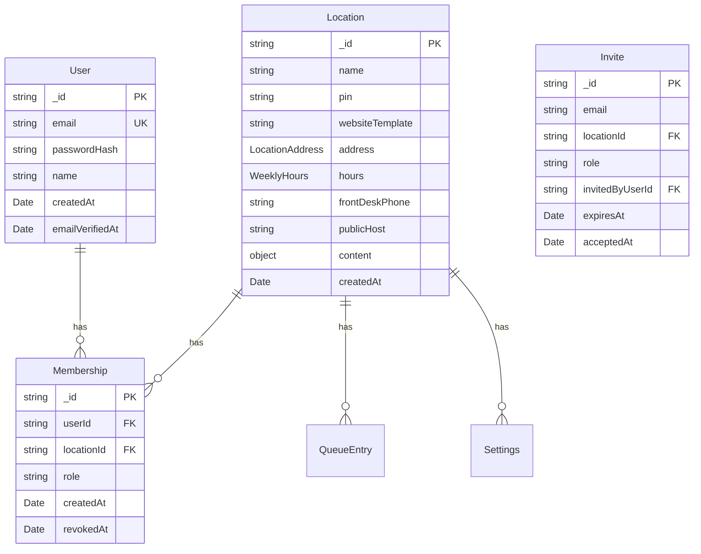

# Feature Specification — Issue #51

**Title:** Fully multi-tenant system (working name TBD — see §5)
**Status:** Draft
**Owner:** sid.mathur@gmail.com
**Related issue:** https://github.com/mathursrus/SKB/issues/51
**Related specs:** [#45 rip-and-replace restaurant website](./45-rip-and-replace-restaurant-website.md), [#46 separate admin view from host view](./46-separate-admin-view-from-host-view.md)
**Related mocks:**
- [`mocks/51-owner-signup.html`](./mocks/51-owner-signup.html)
- [`mocks/51-owner-onboarding.html`](./mocks/51-owner-onboarding.html)
- [`mocks/51-admin-brand-staff.html`](./mocks/51-admin-brand-staff.html)
- [`mocks/51-staff-login.html`](./mocks/51-staff-login.html)
- [`mocks/51-public-template-gallery.html`](./mocks/51-public-template-gallery.html)

---

## 1. Why (Problem & Motivation)

SKB today is a single restaurant's waitlist system that happens to be built on multi-tenant scaffolding. The URL routing (`/r/:loc/...`), the domain model (`Location`, `locationId` on every record), and the host-header rewrite (`skbbellevue.com → /r/skb/`) are all tenant-aware. But the **operational surface is single-tenant**: only the `skb` location is bootstrapped at server start, new locations can only be created by a developer running `ensureLocation()` against the database, and the authentication layer does not actually scope sessions to a location — a host who authenticates against `/r/skb/api/host/login` receives a cookie that is accepted at `/r/any-other-location/api/host/*` as well.

Issue #51 asks us to finish the job: turn SKB into a product that a **restaurant owner can sign up for without developer involvement**, brand as their own, staff with their own people at their own access levels, and operate as a full "operating system for a restaurant" — soup to nuts.

### 1.1 The current gap in concrete terms

| Capability | Today | Issue #51 target |
|---|---|---|
| Onboarding a new restaurant | Run `ensureLocation('slug', 'Name', 'PIN')` by hand in server bootstrap | Owner self-serves from a public signup page |
| Restaurant website branding | Hardcoded "Shri Krishna Bhavan" in `public/home.html`; single palette in `site.css` | Template gallery with 2+ themes; owner picks one and fills in content |
| Staff access | One shared PIN per location; anyone with the PIN has full host + admin capabilities | Named staff accounts with role-scoped access (owner / admin / host) |
| Session scoping | Cookie is a bare HMAC-signed expiry — not tied to a locationId | Session encodes `(userId, locationId, role)`; cross-tenant requests rejected |
| Entry points per persona | One `/r/:loc/` prefix for everything; only differentiation is which HTML file you load | Distinct entry points for diner, host-tablet, staff-portal, and marketing site |
| Product name | "SKB" (specific to the first restaurant on the platform) | Platform name distinct from any one restaurant |

### 1.2 Why this matters now

The existing SKB Bellevue deployment has to keep working during and after this change — `skbbellevue.com`, the `skb` slug, the host-stand PIN tablet, and every integration (Twilio SMS, Voice IVR, Google Business Profile, MCP server) are all in production. Any rename or auth rework that breaks backward compatibility is unacceptable. That tension between "become a product" and "don't bust the only running customer" is what shapes most of the decisions below.

### 1.3 Goals

- **G1** A restaurant owner with no technical background can sign up, provision their own restaurant instance, and reach a live diner-facing queue page inside 10 minutes, without any help from the operator.
- **G2** Staff access is named, role-scoped, and per-restaurant. An admin at restaurant A cannot touch restaurant B even if they know the URL.
- **G3** Each restaurant can pick from at least two website templates and fill in name, hours, address, phone, menu items, and logo/hero image through the admin UI — no code change.
- **G4** The product has a name and a marketing landing page distinct from any one restaurant.
- **G5** The SKB Bellevue deployment (domain, slug, PIN, URLs, integrations, diner experience) continues to work with **zero observable change** to diners and hosts.
- **G6** The host-stand PIN login remains available as a fast shared-device path — adding named accounts must not force a tablet at the host stand to type an email address every 12 hours.

### 1.4 Non-goals (explicit v1 scope cuts)

- **Billing / subscriptions**: no Stripe, no plans, no paywall. Signup is free. A `Billing` tab placeholder is in the admin UI so the path is visible, but the feature is a future issue.
- **Multi-restaurant ownership**: an owner owns exactly one restaurant in v1. If the same person owns two restaurants, they sign up twice. (The User and Membership schema supports many-to-many, but the UI does not expose it.)
- **SSO / OAuth / MFA**: email + password only. Magic links, Google OAuth, and 2FA are future issues.
- **Cross-tenant admin / operator console**: no "super-admin view all restaurants" page. The operator (Sid) continues to manage the platform through MongoDB / MCP tools.
- **Custom domain automation**: restaurants can request a custom domain, but the DNS + TLS setup is operator-assisted in v1 (same as `skbbellevue.com` today). The `publicHost` field already supports this — no new infra needed.
- **Template authoring / theme editor**: owners pick from a fixed set of templates and fill in structured fields. Drag-and-drop page builders, custom CSS, and template marketplaces are out of scope.
- **Renaming the `skb` slug, the `SKB_HOST_PIN` env var, the `skb_host` cookie name, or the existing `/api/*` backward-compat routes.** Legacy names stay; new names live alongside.

---

## 2. Who (User Profiles)

| Persona | Primary concern | Where they enter the product | v1 role |
|---|---|---|---|
| **Restaurant owner** (prospective) | "Can I run my restaurant's waitlist on this thing? How fast do I get started?" | Marketing site `app.example.com/` → Sign up | Owner of exactly one restaurant |
| **Restaurant owner** (active) | "Configure my restaurant, invite my staff, check how the floor is doing." | `app.example.com/login` → routed to their admin | Owner |
| **Restaurant admin** (non-owner manager) | "Tune turn times, run analytics, update hours, edit the menu." | `app.example.com/login` → routed to their admin | Admin |
| **Host / front-desk operator** | "Seat parties, send texts, advance tickets through dining states." | Shared tablet at the host stand, pinned to `restaurant.com/host` → PIN login | Host |
| **Diner** | "Join the line, see my place, get texted when I'm up." | QR code at the door, or the restaurant's public URL → `/join` | (no account) |
| **Platform operator** (Sid) | "Debug a tenant, provision a custom domain, run DB migrations." | Direct DB / MCP access (unchanged) | Out-of-band; no in-app role |

The owner and admin personas collapse onto a single logical UI surface (`/r/:loc/admin.html`); the difference is what they're allowed to do inside it (staff management is owner-only). Host is its own surface (`/r/:loc/host.html`) as established in #46.

---

## 3. Customer's Desired Outcome

> "I run a neighborhood restaurant. I want to turn off my paper clipboard and switch to a waitlist my guests can join from their phone — today. I want to do it myself, with my phone, while sitting at my restaurant. I don't want to talk to a salesperson. I want my cousin who hosts on weekends to have her own login so I can see who did what. And I want the website my guests see when they Google us to actually look like *us* — my logo, my menu, my hours — not a generic skin."

## 4. Customer Problem Being Solved

Independent restaurants don't adopt modern front-of-house software because every option either (a) requires a sales call and a contract, (b) bundles waitlist into a POS they'd have to rip-and-replace, or (c) forces their guests to download an app. The founder's bet: the people who run the restaurant and the people who eat at it should both be able to use the product with nothing more than a URL and a phone. Multi-tenancy is the gate that separates "Sid's friend's restaurant" from "a product anyone can sign up for and use." Without it, every new restaurant requires Sid to SSH into the server, which is neither scalable nor the product anyone wants to build.

---

## 5. Product name: deferred to a dedicated naming sub-task

Our first-pass working name was **Mise** (from *mise en place* — "everything in its place"), which captures the soup-to-nuts restaurant framing well. A post-draft name-availability check surfaced multiple incumbents already using the name in the restaurant/hospitality space:

- **app.trymise.com** — all-in-one restaurant software (POS, catering, recipes, marketplace). Direct category overlap.
- **mise.digital** — AI hospitality agency.
- **getmeez.com** — recipe-management software; phonetically identical ("meez").
- **misenplace.ai** — supply-chain intelligence for hospitality.
- **discovermise.com** — restaurant recipe-management tool.
- **mep-hospitality.com** — restaurant consulting.

These have been added to `fraim/config.json` as competitive references. Because "Mise" is crowded and the load-bearing content of this spec (auth, onboarding, templates, staff roles) does not depend on the brand, **naming is deferred to a dedicated sub-task** that should evaluate (a) domain availability across `.com`, `.app`, `.restaurant`, (b) USPTO trademark search in IC 042 / IC 009, (c) phonetic near-misses, (d) App Store / Play Store name conflicts, and (e) pronunciation.

For the remainder of this spec and all downstream implementation work, the platform is referred to as **"the platform"** (lowercase, descriptive). The `SKB` codebase slug, the `skb` location, the `SKB_HOST_PIN` env var, and the `skb_host` cookie name all stay — `SKB` remains the code-level name of the implementation.

Rebranded surfaces (whatever the chosen name becomes) will include:
- The marketing landing page at the naked domain (currently `/` renders "SKB Waitlist — list of locations"; becomes a marketing page for the platform).
- The signup pages.
- The unified staff login page (`<platform-domain>/login`).
- The `<title>` and header brand block on the admin UI (currently "SKB · Admin"; becomes "{platform} · Admin — {restaurant name}").
- Email subject lines and system-generated SMS signatures that are not restaurant-specific.

The **host stand** branding stays restaurant-specific (currently "SKB · Host"; becomes "{restaurant name} · Host") — a front-desk operator should see their own restaurant's name, not the platform's.

---

## 6. User Experience

The three new experiences are **owner signup**, **owner onboarding**, and **staff account management**. Existing experiences (diner queue, host stand, admin analytics) are preserved with only the branding and auth scoping touched.

### 6.1 Owner signup — `app.example.com/signup`

Entry: marketing landing page at `app.example.com/` with a single "Start free" CTA that routes here.

Step 1 — **Tell us about your restaurant** (single page, no multi-step wizard):

- Restaurant name (free text, 2–80 chars)
- City (free text — used to suggest a default slug)
- Your name, email, password (email must be unique across the platform; password min 10 chars, no other rules in v1)
- Agree to ToS/Privacy checkbox

On submit:
- We derive a default slug from the restaurant name (kebab-case, city suffix if collision) and offer it back with an inline "You'll be at `app.example.com/r/{slug}` — change slug" affordance. Tapping the affordance reveals a slug input with live availability check.
- We provision: a new `Location` with `_id = slug`, a new `User` for the owner, a `Membership` binding the user to that location with `role: owner`, and an auto-generated 4-digit host PIN printed on the next screen.
- We send a welcome email with a link back to the admin (for session continuity across devices).

On success the owner is logged in (cookie minted) and redirected to `app.example.com/r/{slug}/admin.html` with the onboarding wizard open.

**Human fallback**: a link on the signup page says "Prefer to talk to someone? Email hello@example.com." The same link appears on the email-already-taken error and the slug-conflict error. (Per Sid's coaching: always offer a human fallback for edge cases automation can't handle.)

### 6.2 Owner onboarding wizard — first load of `/r/{slug}/admin.html`

A modal overlay that can be dismissed and re-opened from a "Setup" pill in the top bar until all steps are complete. Four steps, rendered as a vertical checklist in the left rail of the admin:

1. **Restaurant basics** — address (structured street/city/state/zip), phone (10 digits), weekly hours grid. These are the existing `Location.address`, `Location.frontDeskPhone`, `Location.hours` fields introduced in #45; we just surface them as the first thing the owner does.
2. **Pick a website template** — a gallery of 2 templates in v1 (see §7). Clicking one previews it in a phone-frame iframe on the right; "Use this template" commits the choice to `Location.websiteTemplate`.
3. **Add your menu** — optional. Upload a PDF (stored in `public/assets/{slug}/menu.pdf` and linked from the template's `/menu` page) OR point `menuUrl` at an external link. Defer-able; the `/menu` page shows "Menu coming soon" until set.
4. **Invite your staff** — optional. Takes the owner to the Staff tab (§6.3). A "Skip for now" link is prominent.

The wizard is entirely additive — if the owner dismisses it and does nothing, the restaurant is still usable with defaults (the default template renders with the address/hours/phone that were entered at signup, the menu page shows "coming soon", and the owner is the only staff). This matters: a new owner who just wants to put a QR at the door tonight should not be blocked by a 4-step setup gate.

### 6.3 Staff management — new `Staff` tab on `/r/{slug}/admin.html`

Visible to role=owner only. Two sections:

**Active staff list** — table with columns: Name, Email, Role, Last active, Actions (Revoke). The owner themselves appear first, tagged "(you)", and the Revoke action is disabled on their own row.

**Invite a teammate** — inline form:
- Email
- Name
- Role (radio: "Admin — can tune settings, see analytics" / "Host — can work the floor only")
- "Send invite" button

On invite:
- Create a pending `User` + `Membership` record. Send the invitee an email with a one-time-use `invite_token` link (`app.example.com/accept-invite?t=<token>`) that lets them set a password and land in their role-appropriate workspace.
- The invite token is valid for 7 days. Expired tokens show "This invite has expired — ask your owner to resend."

On revoke: the membership is soft-deleted (row retained with `revokedAt`) and any existing sessions for that user at that location are invalidated at the next request (cookie fails the membership lookup).

### 6.4 Staff login — `app.example.com/login`

A single unified login page.

- Email + password fields.
- On success, the server looks up the user's memberships. If exactly one, redirect to that restaurant's role-appropriate landing (owner/admin → `/r/{slug}/admin.html`, host → `/r/{slug}/host.html`). If more than one (rare in v1, but the schema supports it), show a "Which restaurant?" picker.
- The cookie minted is `skb_session` (new name alongside the legacy `skb_host`), payload `{userId, locationId, role, exp}`, HMAC-signed with `SKB_COOKIE_SECRET`.

### 6.5 Host stand PIN login (preserved)

The existing flow at `/r/{slug}/host.html` continues to work unchanged for the shared-tablet case: the tablet loads the host URL, shows the PIN pad, and on correct PIN mints a cookie. The only change: the cookie payload now encodes `{locationId, role: 'host', exp}` (no `userId` — this is an anonymous shared-device session). `requireHost` middleware accepts either the named session cookie or the PIN-only cookie as long as the cookie's `locationId` matches the URL's `:loc`.

### 6.6 Entry-point differentiation per persona per restaurant

| Persona | URL on platform domain | URL on custom domain (e.g., skbbellevue.com) |
|---|---|---|
| Diner (first visit) | `app.example.com/r/{slug}/` (restaurant home page) | `skbbellevue.com/` (host-header rewrites to `/r/skb/home.html`) |
| Diner (join line) | `app.example.com/r/{slug}/visit` or `/join` | `skbbellevue.com/visit` |
| Host (shared tablet) | `app.example.com/r/{slug}/host.html` | `skbbellevue.com/host.html` |
| Owner / admin | `app.example.com/r/{slug}/admin.html` | `skbbellevue.com/admin.html` *(admin typically uses `app.example.com` but custom domain works)* |
| Platform marketing | `app.example.com/` (naked domain, no host rewrite) | — |
| Staff login | `app.example.com/login` (no `:loc` — the session routes to the right restaurant) | — |
| Signup | `app.example.com/signup` | — |

The host-header rewrite middleware already handles the custom-domain case for public-facing URLs. The one new rule: `app.example.com/` (or any domain not in the `publicHost` list) routes to the new marketing landing page and signup, not to the legacy locations list.

### 6.7 What the diner sees (unchanged on the surface, rebranded across restaurants)

No material change. The queue page, the SMS copy, the IVR script — all stay in the hospitality tone they have today. What changes is that each restaurant's diner page is rendered from the template they picked in §6.2, filled with their configured name/address/hours/menu, instead of everyone inheriting the Shri Krishna Bhavan site. Diners of SKB Bellevue see exactly what they see today.

---

## 7. Website templates

Two templates in v1. Each is a full set of HTML partials + a CSS theme file; the owner's choice is stored in `Location.websiteTemplate` and resolved at request time by the page renderer.

| Template key | Visual identity | Intended for | Source of visual conventions |
|---|---|---|---|
| `saffron` | Warm cream + saffron + charcoal; Georgia serif for headers; Fira Sans for body | South Indian, Mediterranean, and generally "warm and casual neighborhood spot" | Existing SKB site (`public/home.html`, `public/site.css` from #45) |
| `slate` | Cool off-white + slate blue + forest green; Archivo SemiCondensed for headers; IBM Plex Sans for body | Modern American, contemporary, cocktail-forward | New; inspired by the admin-split mocks from #46 |

Both templates render the same five pages: home / menu / about / hours / contact. They share the same DOM structure so the per-template difference is purely CSS + hero asset slots. A third template (`noodle` — dark + neon, for noodle/ramen/late-night concepts) is explicitly deferred to the next spec iteration so we can ship #51 with a realistic "two is enough to prove the pattern" scope.

Content editing: each template's structured fields are editable in the admin's new "Website" tab:
- Hero headline (one line)
- Hero subhead (two lines)
- "What we're known for" section — 3 cards, each with image upload + title + one-line description
- About section — free text, markdown-lite (paragraphs + bold/italic only)
- Menu — upload PDF or external link (already supported)
- Contact — email + Instagram handle + reservations note

Images go to `public/assets/{slug}/` (existing convention). No CMS, no versioning — "last write wins." Admin shows a "Preview" link that opens the restaurant's public URL in a new tab.

---

## 8. Data Model Changes

### 8.1 New collections

- **`users`** — `{ _id: ObjectId, email: string (unique, lowercased), passwordHash: string (argon2id), name: string, createdAt: Date, emailVerifiedAt?: Date }`. Password hashing via `argon2` node package with default params (m=19MB, t=2, p=1).
- **`memberships`** — `{ _id, userId, locationId, role: 'owner' | 'admin' | 'host', createdAt, revokedAt? }`. Composite index `(userId, locationId)`. A user has at most one active (non-revoked) membership per location.
- **`invites`** — `{ _id, email, locationId, role, invitedByUserId, token: string (random 32 bytes, base64url), expiresAt, acceptedAt? }`. Tokens are single-use; on accept, the token is deleted and a membership is inserted.

### 8.2 Changes to `locations`

- `websiteTemplate?: 'saffron' | 'slate'` — absent ⇒ `'saffron'` (preserves the SKB look).
- `content?: { heroHeadline?, heroSubhead?, knownFor?: [{title, desc, image}], about?, contactEmail?, instagramHandle?, reservationsNote? }` — structured editable content. Absent fields fall back to template defaults.

### 8.3 Changes to `queue_entries`, `settings`, `queue_messages`

None. These are already location-scoped.

### 8.4 Session / auth changes

- New cookie `skb_session`, payload base64url-encoded JSON `{uid, lid, role, exp}`, HMAC-SHA256 with `SKB_COOKIE_SECRET`. 12-hour expiry.
- The legacy `skb_host` cookie continues to mint but its payload gains `{lid}` alongside the existing `exp`. The cookie string format goes from `<exp>.<mac>` to `<lid>.<exp>.<mac>`; the verifier accepts both shapes during a deprecation window (two releases) so existing tablets with in-flight cookies aren't logged out.
- `requireHost` middleware (`src/middleware/hostAuth.ts`) becomes `requireRole(role, ...)` that:
  1. Extracts either `skb_session` or `skb_host`, verifies HMAC.
  2. Extracts `locationId` from the cookie payload.
  3. Compares to `req.params.loc`; on mismatch, 403 (not 401 — the user is authenticated, just not for this tenant).
  4. Checks role is in the allowed set (`host`, `admin`, `owner`). Ownership of role-restricted endpoints is enforced at the route level, not the middleware.

### 8.5 Endpoint changes

New:
- `POST /api/signup` — provision a new owner + location. Rate-limited to 5 per IP per hour.
- `POST /api/login` — unified email/password login, mints `skb_session`.
- `POST /api/logout` — clears both cookie names.
- `POST /r/:loc/api/staff/invite` — role=owner only.
- `POST /r/:loc/api/staff/revoke` — role=owner only.
- `GET /r/:loc/api/staff` — role in (owner, admin).
- `POST /api/accept-invite` — public; token-bound.
- `POST /r/:loc/api/config/website` — update `websiteTemplate` and `content`; role in (owner, admin).
- `GET /templates` — static JSON listing available templates for the picker UI.

Modified:
- `POST /r/:loc/api/host/login` — unchanged shape, now mints location-scoped `skb_host` cookie.

Unchanged: every existing queue, host, dining, and analytics endpoint. (They all live under `/r/:loc/api/...` and the middleware change is transparent.)

---

## 9. Compliance Requirements

No formal regulations are configured in `fraim/config.json`. The applicable obligations I've inferred from the feature surface:

### 9.1 Tenant data isolation (SOC2-adjacent)

Every query to `queue_entries`, `settings`, `queue_messages`, `invites`, and `memberships` MUST include `locationId` in the filter. This is already true for the queue collections; the new ones inherit the rule. **Validation**: a repo-wide grep for `collection(db).find(` / `.findOne(` / `.updateOne(` that does not include `locationId` in the filter clause returns zero results for the four tenant-scoped collections. A code-review rule and a dedicated unit test (the "cross-tenant probe" — §11.3) enforce this.

### 9.2 Authentication credential handling

- Passwords stored as argon2id hashes, never logged, never returned from the API.
- Login endpoints rate-limited (5 attempts per email per 15 minutes, then 15-minute lockout with a generic "too many attempts" message).
- Failed login logs: include IP + email attempted, do not include the password or derivative. (This matches the existing `host.auth.fail` log pattern in `src/routes/host.ts:96`.)
- Invite tokens are 32 random bytes, single-use, 7-day TTL; invalidated on use or revoke.

### 9.3 TCPA / SMS consent

Unchanged. Diner phone + `smsConsent` capture at queue-join time is already TCPA-compliant; multi-tenancy does not touch this path. Per-restaurant Twilio numbers are deferred (one shared platform number today); the `from` address on outbound SMS continues to be `TWILIO_PHONE_NUMBER`.

### 9.4 PII handling

- Diner PII (name, phone, SMS thread) stays scoped to the restaurant that captured it; revoked staff lose access at the next request.
- Staff PII (email, name) visible only within their own restaurant's admin UI.
- No cross-tenant analytics / leaderboard / "compare your restaurant to others" in v1 — this would require explicit consent and anonymization logic we don't have.

### 9.5 Explicit non-obligations

- **PCI DSS** — not applicable. No card numbers, no payment processing. Billing is out of scope.
- **HIPAA** — not applicable.
- **GDPR** — we operate in the US only today, but the data-isolation + PII-scoping rules are GDPR-aligned as defense-in-depth.

---

## 10. Design standards applied

Mocks use the generic UI baseline established by existing feature specs in this repo. Specifically:

- **Admin surfaces** (signup, onboarding, staff tab): reuse the "admin split" visual palette from mock #46 — off-white surfaces, teal accent `#1f6a5d`, warm action `#cb6a34`, Archivo SemiCondensed + IBM Plex Sans, 28px rounded cards, glassmorphic top bar. This keeps the new multi-tenant admin pages visually consistent with the existing admin workspace.
- **Public marketing landing** (`app.example.com/`): new. Warm-to-cool gradient background, large serif hero, single CTA. Borrowing color hooks from both templates so the marketing site doesn't imply either template is "the canonical platform look."
- **Restaurant public templates**: the `saffron` template *is* the existing #45 site, preserved as-is. The `slate` template reuses the admin-split palette minus the orange to avoid confusion with the admin surface.

No markdown code-block UI mocks anywhere — all mocks are HTML + CSS files under `docs/feature-specs/mocks/51-*.html`, viewable by opening them directly in a browser. Each mock is self-contained (inline CSS, public asset URLs for any images) so a non-technical reviewer can open them without a build step.

Per Sid's durable feedback (mistake pattern: "Mocks must show the user journey on the external platform, not the implementation details"): the mocks render what the **owner** and **staff** see — the signup form, the invite modal, the template gallery, the staff list, the role picker. They do not show JSON payloads, DB rows, or cookie contents. Implementation details are documented in §8, not in the mocks.

---

## 11. Validation Plan

### 11.1 Owner signup happy path

1. In a fresh browser (no cookies), visit `http://localhost:3000/signup`.
2. Fill the form with restaurant name "Ramen Yokocho", city "Seattle", your name, a new email, password.
3. Expect: redirect to `/r/ramen-yokocho/admin.html`, onboarding wizard visible, a welcome email dispatched (visible in the Mailpit/dev console log).
4. Click through the wizard: enter an address, pick the `slate` template, skip menu, skip staff.
5. Open a new incognito tab, visit `/r/ramen-yokocho/`. Expect: the restaurant home page rendered with the `slate` template, showing the address you just entered.
6. Verify in Mongo: one `locations` row with `_id: "ramen-yokocho"`, one `users` row, one `memberships` row with `role: "owner"`.

### 11.2 Invite + role gating

1. As the owner of `ramen-yokocho`, invite `host@example.com` with role=host.
2. Open the invite email link in another browser, set a password, accept. Expect redirect to `/r/ramen-yokocho/host.html` with the host queue visible.
3. From the same browser (still logged in as host), attempt to load `/r/ramen-yokocho/admin.html`. Expect: 403, or a redirect to `/host.html` with a "You don't have access to the admin workspace" toast.
4. From the host session, make a direct fetch to `/r/ramen-yokocho/api/staff/invite`. Expect: 403.

### 11.3 Cross-tenant probe (the core multi-tenancy test)

1. Create two restaurants, `a` and `b`, with different owners.
2. Log in as owner of `a`. Copy the cookie.
3. Make fetches to `/r/b/api/host/queue`, `/r/b/api/staff`, `/r/b/admin.html`. **All must return 403.**
4. From owner-of-`a`'s session, attempt to POST to `/r/b/api/config/website`. Must return 403.
5. Automate as an integration test in `tests/integration/multi-tenancy.test.ts` — this test is the compliance-validation evidence for §9.1.

### 11.4 Backward compatibility — SKB Bellevue

1. Delete all new cookies; visit `skbbellevue.com/` (locally: simulate with a `Host: skbbellevue.com` header via curl). Expect: the existing SKB home page, unchanged.
2. Visit `skbbellevue.com/queue.html`. Expect: the diner queue, unchanged.
3. Visit `skbbellevue.com/host.html`. Enter the existing SKB PIN. Expect: logged in, queue visible. Verify the issued `skb_host` cookie includes `lid=skb`.
4. Using the OLD cookie format (pre-deploy, `<exp>.<mac>` without `lid`), hit `/r/skb/api/host/queue`. Expect: accepted during the deprecation window, logged with `auth.legacy-cookie.accept`.
5. After the deprecation window (two releases), repeat step 4. Expect: 401.

### 11.5 Template switching

1. As owner, switch `ramen-yokocho` from `slate` to `saffron` in the Website tab.
2. Reload `/r/ramen-yokocho/`. Expect: warm theme applied, same structured content (name, address, hours) preserved.
3. Switch back. Expect no data loss.

### 11.6 Compliance validation

- §9.1: cross-tenant probe (11.3) must pass. Manual grep audit pre-merge: every `find*`/`update*`/`delete*` call on `queue_entries`, `settings`, `queue_messages`, `invites`, `memberships` has a `locationId` (or `userId` for user-owned docs) filter.
- §9.2: unit test that the login endpoint returns 429 after 5 failures in 15 minutes; unit test that `passwordHash` is never in any API response (JSON schema check on user endpoints).
- §9.3: unchanged from today.

### 11.7 Browser-level smoke

Once implemented, open the following mocks in a browser and click through them with someone non-technical in the room; confirm they understand the flow without being told what to click:
- `mocks/51-owner-signup.html`
- `mocks/51-owner-onboarding.html`
- `mocks/51-admin-brand-staff.html`
- `mocks/51-staff-login.html`
- `mocks/51-public-template-gallery.html`

---

## 12. Implementation sequencing (informational — actual sequencing decided in the implementation spec)

A single monolithic PR would be unwieldy. Recommend breaking #51 into these sub-issues, shipped in order:

1. **Auth refactor**: cookie payload gains `locationId`, middleware enforces tenant scoping, cross-tenant probe test added. Backward-compat for legacy cookies. No user-visible change.
2. **User + Membership schema + unified login**: introduce `users`, `memberships`, `skb_session` cookie, `app.example.com/login` page. Existing PIN login continues to work unchanged.
3. **Owner signup + onboarding wizard**: signup endpoint, onboarding modal, template defaults to `saffron` (SKB look).
4. **Staff invites + role gating**: invite/accept/revoke flow, role-gated admin endpoints, Staff tab in admin UI.
5. **Website template system**: `slate` template, Website tab in admin, content editing.
6. **Marketing landing + rebrand**: `app.example.com/` landing, brand-block changes in admin UI.

Each sub-issue is independently shippable and reversible. Legacy SKB keeps working after every one.

---

## 13. Alternatives

| Alternative | Why discarded |
|---|---|
| **Product name "Covers"** (restaurant term for guests seated) | Crisp and industry-native, but "covers" is overloaded (think "cover letter", "coverage", "album covers") and makes product search results noisy. Second choice if "Mise" tests poorly. |
| **Product name "Foyer"** | Nicely evocative of the front-of-house entry experience. Rejected because pronunciation varies (FOY-er vs FWAH-yay) and it implies lobby/entry only — not "soup to nuts". |
| **Product name "Host"** | Too generic and already taken (Host in SKB's own ops lexicon means the person at the stand). Would collide with staff role. |
| **Let each restaurant run its own deployment** (fork per tenant) | Zero isolation work; maximum ops work. Rejected: operator can't provision, debug, or upgrade across tenants. This is what issue #51 explicitly rejects. |
| **Subdomain-per-tenant only (`skb.app.example.com`), no custom domains** | Simpler DNS. Rejected because `skbbellevue.com` already exists and the host-header rewrite already works — cost of losing an existing capability. |
| **OAuth / Google SSO at signup** | Standard SaaS onboarding. Rejected for v1 per simplicity preference — email/password is shippable in a week; OAuth adds a provider integration. Deferred to a later issue once we have sign-up volume to justify. |
| **Immediate billing / plan selection at signup** | Standard SaaS pattern. Rejected: we have one paying customer (Sid/SKB, free) and zero customer development interviews completed with prospective paying restaurants — billing design requires discovery. Free for v1. |
| **No PIN login, email/password only** | Simplest auth surface. Rejected — a tablet at the host stand typing a full email every 12 hours is worse UX than a 4-digit PIN pad. PIN stays. |
| **PIN-only (no email/password at all)** | What we have today. Rejected — doesn't satisfy G2 (role scoping, named access) or G3 (owner self-serve). |
| **Per-tenant Mongo database instead of per-tenant `locationId` filtering** | Strongest isolation boundary. Rejected for v1: the existing code is all `locationId`-filtered and refactoring to multi-DB would touch every query file. Cost greatly exceeds the v1 risk. Revisit when we have more than ~20 tenants or the first enterprise customer asks. |
| **Template authoring / full theme editor** | A richer product. Out of scope per §1.4 — two templates with structured fields is "sufficient evidence the pattern works" and lets us ship. |

---

## 14. Competitive Analysis

Comparative matrix of fourteen competitors fetched 2026-04-17. Any pricing not visible on the fetched page is flagged "not public as of 2026-04-17." Pricing figures are cited rather than asserted to avoid the precise-looking-numbers failure mode from prior work.

### 14.1 Matrix

| # | Competitor | Category | Signup model | Pricing (monthly, USD) | Multi-tenant / multi-location | Positioning vs. our platform | Source |
|---|---|---|---|---|---|---|---|
| 1 | Yelp Guest Manager | Waitlist / reservations | Sales-gated — "Schedule a call," "Request a demo" | Not public as of 2026-04-17 | Both independents and multi-location brands (11,000+ restaurants) | Enterprise-leaning, sales-led; our platform is self-serve, free-in-beta | [Yelp Guest Manager](https://business.yelp.com/restaurants/products/guest-manager-product-news/) |
| 2 | Yelp Host | Waitlist / floor management | Self-serve + optional Calendly demo | Basic $149; Plus $399; bundle w/ Guest Mgr $199; 30-day free trial | Both; multi-location groups go custom | Closest feature overlap (waitlist + SMS). ~$149 floor vs. our beta-free tier | [Yelp Host](https://business.yelp.com/restaurants/products/yelp-host/) |
| 3 | Waitly | Waitlist / SMS | Self-serve sign-up | Flat $99/mo; free signup path advertised | Both (Great Wolf Lodge alongside SMBs) | Single-tier SaaS; no website builder, no voice IVR | [Waitly](https://waitly.com) |
| 4 | NextMe | Waitlist / queue | Self-serve (pricing page returned 403 on direct fetch) | Free tier w/ 100 SMS; paid ~$49.99–$125/mo per third-party reports, not directly verified 2026-04-17 | Independents primary | Single-function waitlist, no branded website or voice | [NextMe](https://www.nextmeapp.com) |
| 5 | TablesReady | Waitlist / reservations | Self-serve, 14-day free trial | "Starts at $39/mo" (tier names not shown) | Both; 2,000+ locations | No-hardware SMS waitlist; no website builder, no voice IVR | [TablesReady](https://www.tablesready.com) |
| 6 | Waitlist Me | Waitlist / SMS | Self-serve | "Starts at $27.99/mo"; 3 tiers; 20% annual discount | Both (Red Robin cited) | Cheapest direct waitlist competitor; no website / voice | [Waitlist Me](https://www.waitlist.me) |
| 7 | Waitwhile | Waitlist (horizontal) | Self-serve free trial | Free $0 (1 loc, 50 visits); Starter from $31; Business from $55; Enterprise custom | Both; horizontal across retail / healthcare / gov — not restaurant-specific | Strong free tier but not restaurant-shaped; no menus, no voice | [Waitwhile](https://waitwhile.com/pricing) |
| 8 | Slang.ai | Voice / AI answering | Sales-gated — "Try Slang AI" opens demo booking | Not public on slang.ai 2026-04-17; third-party reports Core ~$380–$399, Premium ~$540 | Both; cross-sell across locations | Premium voice-only; steep for beta-stage indies | [Slang.ai](https://www.slang.ai) |
| 9 | GoodCall | Voice / AI phone agent | Self-serve — "No gated demos, no engineering dependencies" | Starter $79, Growth $129, Scale $249 per agent/mo; 15–30% annual discount | Horizontal SMB (healthcare, home services, retail, restaurants) | Self-serve voice, but not restaurant-shaped (no menu / waitlist tie-in) | [GoodCall pricing](https://www.goodcall.com/pricing) |
| 10 | Popmenu AI Answering | Voice / AI answering | Sales-gated — "Schedule a demo, 20-minute demo" | Not public as of 2026-04-17 | Both; separate pages for 1, 2–10, 11+ locations | Part of larger Popmenu platform; demo wall blocks owner self-serve | [Popmenu AI Answering](https://get.popmenu.com/ai-answering) |
| 11 | BentoBox | Website / ordering | Sales-gated — "Get started with Clover," Sign In; no self-serve signup visible | Not public as of 2026-04-17 | Both (indies + chains / hotel groups / food halls) | Premium restaurant website CMS; sales motion, no self-serve beta lane | [BentoBox](https://www.getbento.com) |
| 12 | Squarespace (Restaurants) | Website builder (horizontal) | Self-serve, free trial | Tiers advertised but dollar amounts not surfaced on restaurants landing page 2026-04-17 | Independents primarily | Generic website builder; no native waitlist or restaurant voice / SMS | [Squarespace Restaurants](https://www.squarespace.com/websites/restaurants) |
| 13 | Wix Restaurants | Website / ordering / reservations | Self-serve | Not shown on /restaurant/website 2026-04-17 (generic /plans link only) | Independents primarily | Full website + ordering + reservations; no IVR or waitlist-first UX | [Wix Restaurants](https://www.wix.com/restaurant/website) |
| 14 | Menubly | Menu / mini-site builder | Self-serve, no credit card | Free $0; Pro $9.99 ($7.99 annual); Custom contact sales | Independents | Cheapest menu / QR builder; no waitlist, no voice, no role-scoped staff | [Menubly](https://www.menubly.com) |

### 14.2 The platform's differentiation pillars

1. **Self-serve in a sales-gated category.** Yelp Guest Manager, Slang.ai, Popmenu AI Answering, and BentoBox all require a demo or sales call before an owner can see the product. Our public signup + free beta is a direct wedge against that motion — issue #51 exists precisely to deliver this lane.
2. **Restaurant-shaped bundle, not horizontal.** Waitwhile and GoodCall are self-serve but cross-industry; Squarespace and Wix are generic website builders. The platform uniquely fuses waitlist + SMS + voice IVR + branded website + role-scoped staff logins under one restaurant-native tenant — each piece is useful, but the bundle is the moat.
3. **Price floor advantage.** Direct waitlist competitors floor at ~$28 (Waitlist Me) to $399 (Yelp Host Plus); voice competitors floor at ~$79 (GoodCall) to ~$380+ (Slang.ai). Our free-in-beta undercuts every one while beta learning compounds. Billing is out of scope for v1 but the positioning requires the Billing tab placeholder (§6.2) so the path is visible — "we're free now, we won't always be" is honest.
4. **True multi-tenant for independents.** Most "multi-location" competitors mean chains under one brand; our tenancy model serves thousands of unrelated independents as peers. The `User` + `Membership` model (§8.1) is shaped for that — every owner owns their own restaurant, not a unit inside someone else's franchise.

### 14.3 Competitive response strategy

- **If Yelp or Popmenu launches a free tier**: lean into voice + website + waitlist bundle (none of them ship all three self-serve). Our moat is not price — it's the restaurant-shaped product surface.
- **If Waitwhile or GoodCall adds restaurant-specific UX**: lean into SKB Bellevue's hospitality-tone diner copy (a durable preference recorded in the product) and the IVR flow that reads live wait times — horizontal tools won't invest in one vertical's voice of.
- **If a new well-funded entrant copies the bundle**: speed + existing prod deployment (SKB Bellevue as reference customer from day one). The feature surface is not the defensible part; the 18-month lived understanding of "what a small restaurant operator actually does with a tablet during a Friday rush" is.

### 14.4 Research sources

Sources fetched 2026-04-17 via web fetch and web search:
- [Yelp Guest Manager](https://business.yelp.com/restaurants/products/guest-manager-product-news/), [Yelp Host](https://business.yelp.com/restaurants/products/yelp-host/)
- [Waitly](https://waitly.com), [TablesReady](https://www.tablesready.com), [Waitlist Me](https://www.waitlist.me), [Waitwhile pricing](https://waitwhile.com/pricing), [NextMe](https://www.nextmeapp.com)
- [Slang.ai](https://www.slang.ai) (pricing via [synthflow.ai](https://synthflow.ai/blog/slang-ai-pricing) and [loman.ai](https://loman.ai/blog/slang-ai-reviews-pricing-alternatives)), [GoodCall pricing](https://www.goodcall.com/pricing), [Popmenu AI Answering](https://get.popmenu.com/ai-answering)
- [BentoBox](https://www.getbento.com), [Squarespace Restaurants](https://www.squarespace.com/websites/restaurants), [Wix Restaurants](https://www.wix.com/restaurant/website), [Menubly](https://www.menubly.com)

---

## 16. Open questions

- **Slug collisions across the platform**: two restaurants named "The Corner" in different cities both default to `the-corner`. Strategy: append a city suffix (`the-corner-seattle`), then a `-2` integer suffix if the city is also taken. Final approach confirmed in implementation.
- **Password reset**: out of scope for the v1 spec body, but table-stakes for a SaaS. Should we squeeze in a basic "email me a reset link" flow under the auth-refactor sub-issue? Default assumption: yes, it's cheap and the alternative (tell users to message Sid) doesn't scale even in early beta.
- **Custom domain automation**: DNS verification, TLS cert issuance (Azure-managed), and `publicHost` wiring. Currently operator-assisted. Deferred to a later issue, but flag for marketing — the landing page should say "Custom domain available on request" rather than promising automated setup.
- **MCP tools + multi-tenancy**: the MCP server accepts PIN-bearer auth with a per-request `X-SKB-Location` header; it is already tenant-scoped. Confirm the named-user model doesn't need to be mirrored into MCP in v1 — the PIN-bearer path is sufficient for agent integrations today.
- **Onboarding completion rate instrumentation**: we should log `onboarding_step_completed` events so we can see whether owners finish the wizard. Scope TBD.
