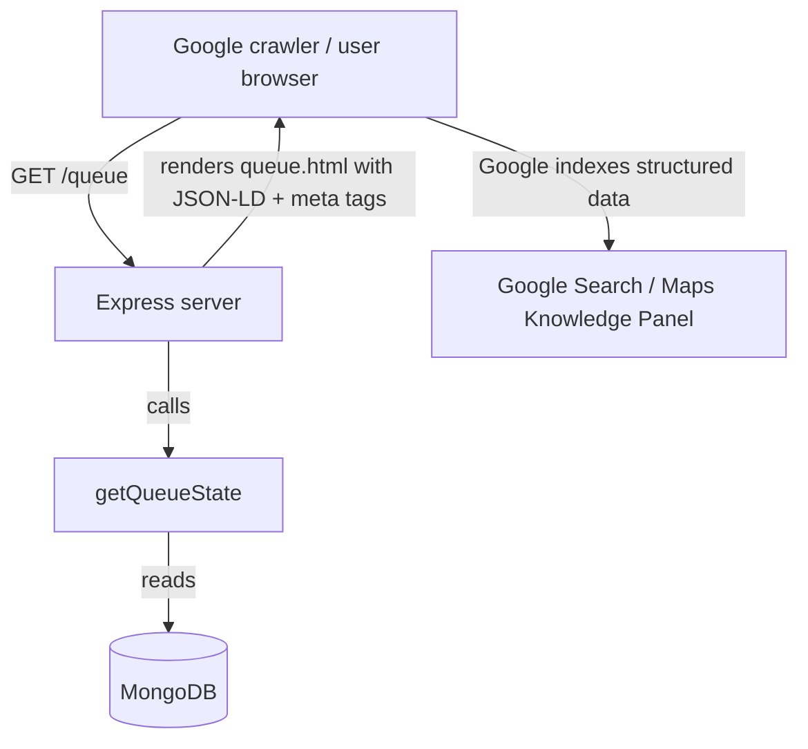

# Feature: Wait-time Widget for Google Maps / Search

Issue: [#8](https://github.com/mathursrus/SKB/issues/8)
Owner: Claude (agent)

## Customer

**Potential diner** -- someone searching "Shri Krishna Bhavan" on Google (Maps or Search) from home, work, or on the road. They have not yet committed to driving over and need a quick signal about whether it is worth the trip right now.

## Customer's Desired Outcome

"Before I leave, I can see the current wait at SKB right in Google Search or Maps, so I can decide whether to head over now or try later."

## Customer Problem being solved

SKB already has a public queue page (`/queue`) that shows the live wait, but potential diners who search on Google never see that data. They see the restaurant listing with hours, reviews, and photos -- but no wait-time signal. Without that signal they either:

1. Drive over blind and discover a 40-minute wait at the door (leading to frustration or walk-aways).
2. Assume the restaurant is always packed and skip it entirely (lost revenue).

Surfacing wait-time data in Google Search and Maps closes this information gap before the diner leaves home.

## User Experience that will solve the problem

### How the diner sees it (no action required from diner)

1. Diner searches "Shri Krishna Bhavan Bellevue" on Google.
2. In the Knowledge Panel or Maps listing, they see a line like **"Current wait: ~24 min (5 parties ahead)"** -- sourced from the structured data on SKB's queue page.
3. Diner decides to drive over (or check back later). No app install, no click-through required for the headline number.
4. If diner clicks through to the queue page, they land on `/queue` and can join the line as usual.

### What changes technically

1. **Server-side JSON-LD injection**: The Express server renders `queue.html` as a template instead of a static file. On each request it calls `getQueueState()` and injects a `<script type="application/ld+json">` block into the `<head>` containing a `Restaurant` entity with `makesOffer` describing the current wait time.
2. **Meta tags**: Add `<meta>` tags for `og:title`, `og:description`, and `description` that include the live wait time, so link previews (iMessage, WhatsApp, social) also show the number.
3. **Google Business Profile (deferred to v2)**: Integrate with the Google Actions Center Waitlist API so "Join waitlist" appears directly in Google Maps. This requires a 12-14 week partner onboarding and is out of scope for v1.

### Data flow

### UI mocks

- [`docs/feature-specs/mocks/8-queue-with-jsonld.html`](./mocks/8-queue-with-jsonld.html) -- queue page with injected JSON-LD and meta tags (view source to inspect structured data)

### Design Standards Applied

Used the **generic UI baseline** (no project-specific design system configured in `fraim/config.json`). No visible UI changes for v1 -- the JSON-LD and meta tags are invisible metadata. The existing queue.html layout, typography, and interaction model remain unchanged. Mobile-first constraint is preserved since no new UI elements are added.

## Functional Requirements (traceable)

| ID | Requirement |
|---|---|
| R1 | Server SHALL render `queue.html` as a server-side template, injecting a `<script type="application/ld+json">` block into `<head>` on every request. |
| R2 | The JSON-LD block SHALL contain a `Restaurant` entity (`@type: "Restaurant"`) with `name`, `address`, `url`, `telephone`, and `servesCuisine` properties matching SKB's real details. |
| R3 | The JSON-LD block SHALL include a `makesOffer` property with a textual description of the current wait time and parties waiting, derived from `getQueueState()`. |
| R4 | When `partiesWaiting` is 0, the JSON-LD offer description SHALL read "No wait -- walk right in" (or equivalent). |
| R5 | Server SHALL inject `<meta name="description">` and `<meta property="og:description">` tags containing the current wait time (e.g., "Current wait: ~24 min, 5 parties ahead"). |
| R6 | The injected structured data SHALL contain only aggregate queue metrics (`partiesWaiting`, `etaForNewPartyMinutes`). It SHALL NOT contain individual party names, codes, or any PII. |
| R7 | The existing client-side JavaScript (`queue.js`) SHALL continue to function unchanged -- the client-side fetch to `/api/queue/state` remains the source of truth for the interactive UI. |
| R8 | The server-side template rendering SHALL NOT increase median response time for `GET /queue` by more than 50ms compared to static file serving. |

### Acceptance criteria (Given/When/Then)

- **AC-R1**: *Given* the Express server is running, *when* a browser or crawler requests `GET /queue`, *then* the HTML response contains a `<script type="application/ld+json">` block in the `<head>`.
- **AC-R3**: *Given* 5 parties are waiting with `avgTurnTimeMinutes=8`, *when* a crawler fetches `/queue`, *then* the JSON-LD contains text indicating approximately 48 minutes wait and 5 parties.
- **AC-R4**: *Given* 0 parties are waiting, *when* a crawler fetches `/queue`, *then* the JSON-LD offer description indicates no wait.
- **AC-R5**: *Given* 3 parties are waiting, *when* any client fetches `/queue`, *then* the `<meta name="description">` content includes "~32 min" and "3 parties".
- **AC-R7**: *Given* the server-side template is active, *when* a diner loads `/queue` in a browser, *then* the join form, status card, and refresh button all function identically to the current static-file behavior.
- **AC-R8**: *Given* normal load, *when* 100 sequential requests hit `GET /queue`, *then* the median response time is within 50ms of the baseline (static file serving).

### Edge cases

- MongoDB is down or `getQueueState()` throws: serve `queue.html` with empty JSON-LD (valid but without wait data) and a generic meta description. Do not block page load.
- `partiesWaiting` is very large (e.g., 50+): still render the real number; do not cap or hide it.
- Google crawls during off-hours (restaurant closed, queue empty): JSON-LD shows "No wait" -- this is accurate since there is no queue.
- Multiple rapid requests from Googlebot: rate limiting on `/api/queue/join` exists but `GET /queue` is not rate-limited, which is correct since it is read-only.

## Compliance Requirements (if applicable)

No formal regulations are configured in `fraim/config.json`. General privacy best-practices inferred from project context:

- **No PII in structured data**: Only aggregate numbers (`partiesWaiting`, `etaForNewPartyMinutes`) appear in JSON-LD and meta tags. No names, codes, or phone digits.
- **No new data collection**: This feature is read-only; it does not collect any information from the user or crawler.
- **Google Structured Data policies**: The JSON-LD must accurately reflect the live queue state. Hardcoded or misleading wait times would violate Google's [structured data policies](https://developers.google.com/search/docs/appearance/structured-data/sd-policies) and risk manual action.
- **No third-party tracking**: No new analytics scripts are added to the queue page.

## Validation Plan

- **Google Rich Results Test**: Paste the rendered HTML from `GET /queue` into [Google's Rich Results Test](https://search.google.com/test/rich-results) and confirm the Restaurant entity is recognized with no errors.
- **Manual (browser)**: Load `/queue` in a browser, view page source, verify the `<script type="application/ld+json">` block contains accurate wait data matching the API response from `/api/queue/state`.
- **Automated test**: Add an integration test that starts the server, seeds the queue with N parties, fetches `GET /queue`, and asserts:
  - HTML contains a valid JSON-LD block with `@type: "Restaurant"`.
  - The wait-time text in JSON-LD matches expected `(N+1) * avgTurnTimeMinutes`.
  - The `<meta name="description">` content includes the correct wait time.
- **Zero-queue test**: Verify that with 0 parties, the JSON-LD says "No wait."
- **Fallback test**: Simulate a DB error and verify the page still renders without crashing, with a generic meta description.
- **Performance**: Run a simple load test (100 requests) comparing static vs. templated response times; assert delta is under 50ms.
- **Compliance validation**: Inspect the rendered HTML to confirm no individual party data (names, codes, phone digits) appears anywhere outside the client-side JS flow.

## Alternatives

| Alternative | Why discard? |
|---|---|
| Client-side-only JSON-LD injection (inject via JavaScript after API fetch) | Google renders JS but unreliably for structured data; server-side injection is the recommended approach per Google's documentation. |
| Google Actions Center Waitlist integration (v2 candidate) | Requires 12-14 week partner onboarding, dedicated technical resources, and a formal business agreement with Google. Too heavy for v1; valuable as a future phase. |
| Google Business Profile "popular times" only (no code change) | Google auto-generates popular times from aggregated location data, but this shows historical patterns, not real-time wait. Does not solve the "should I go NOW" question. |
| Expose a standalone `/api/queue/wait-widget` endpoint returning HTML embed | Over-engineering; the queue page itself is the right surface. An embed would also need CORS and iframe security considerations. |
| Add a visible "Share your wait" button for diners to post on social | Relies on diner action; inconsistent coverage; does not help the "searching on Google" use case. |

## Competitive Analysis

### Configured Competitors Analysis

No competitors configured in `fraim/config.json`. Section deferred pending `business-plan-creation` or manual entry.

### Additional Competitors Analysis

| Competitor | Current Solution | Strengths | Weaknesses | Customer Feedback | Market Position |
|---|---|---|---|---|---|
| Yelp Waitlist (Yelp Guest Manager) | Shows "Join Waitlist" in Yelp app; integrates with Reserve with Google so diners can join waitlist from Google Search/Maps | Large audience; SMS notifications; integrated with Yelp reviews; Google Reserve partnership surfaces wait in Maps | Wait data owned by Yelp, not the restaurant; monthly SaaS fee; diner funneled through Yelp ecosystem where competitor restaurants appear | "Useful if I'm already on Yelp, but I usually just Google it" | Dominant in US casual dining waitlist |
| Google Reserve / Actions Center partners | "Join waitlist" button appears directly in Google Maps for enrolled restaurants via partner integrations (Yelp, SevenRooms, etc.) | Native Google integration; zero friction for diner; real-time wait visible | Requires 12-14 week onboarding; ongoing API maintenance; only available through approved partners; restaurants cannot self-enroll | "Love seeing 'Join waitlist' right in Maps" | Growing; mostly chain restaurants and those using approved POS partners |
| SevenRooms | Waitlist shared via QR code or Google Reserve; full reservation + waitlist + CRM platform | Deep Google Reserve integration; CRM and marketing tools; data ownership for restaurant | Enterprise pricing; complex setup; overkill for single-location indie restaurant | "Powerful but expensive for a small place" | Premium/enterprise segment |
| TablesReady | Guests join via QR code, SMS, website, or Google; branded wait page with place-in-line and ETA | Google integration; branded experience; reasonable pricing for SMBs | Still a SaaS dependency; wait data not visible in organic Google Search results (only through Reserve with Google) | "Easy to set up, guests like the text updates" | Mid-market SMB restaurants |
| Waitwhile | Virtual waitlist via SMS, QR code, or kiosk; real-time wait estimates; automated notifications | No app download needed; AI-powered wait estimates; modern UX | SaaS fee; no direct Google Search structured data surfacing; wait visible only on their hosted page | "Slick experience but another subscription" | Growing in multi-industry queue management |
| NextMe | SMS-first waitlist; basic analytics; simple setup | Fast setup; low cost; SMS core | Thin customer-facing UX; no Google Search integration; wait data not discoverable via search | "Good for tiny places" | Small US restaurants |
| No digital waitlist (paper list) | No wait-time data available anywhere | Zero cost | Diner has zero visibility before arriving; drives blind visits and walk-aways | "I drove 20 minutes to find a 45-minute wait" | Vast majority of small independents |

### Competitive Positioning Strategy

#### Our Differentiation
- **Key Advantage 1**: Wait time visible in Google Search results via structured data -- no app, no partner program, no click-through required for the headline number. Every competitor (Yelp, SevenRooms, TablesReady) requires a SaaS subscription and Google Reserve partnership to surface wait data in Maps. SKB achieves partial visibility through standard structured data at zero cost.
- **Key Advantage 2**: Real-time accuracy -- JSON-LD is generated from live queue state on every page load, not historical averages (Google popular times) or manual host updates.
- **Key Advantage 3**: Full data ownership -- unlike Yelp Guest Manager where diner data flows through Yelp's ecosystem (and competitor restaurants appear alongside), SKB owns the queue data end-to-end.
- **Key Advantage 4**: No vendor lock-in -- structured data is an open standard. If SKB later adds a Google Reserve partnership (v2), the JSON-LD continues working independently as a fallback.

#### Competitive Response Strategy
- **If Google Actions Center lowers onboarding barriers**: Pursue v2 integration for the "Join waitlist" button in Maps, layered on top of the v1 structured data. This would match Yelp Guest Manager's Google Reserve integration.
- **If Yelp surfaces wait times in organic Google Search**: Differentiate on data ownership -- SKB's data comes from its own system, not a third-party estimate. Yelp's data would also show competitor restaurants.
- **If TablesReady or Waitwhile add structured data to hosted wait pages**: SKB's advantage is that the structured data lives on SKB's own domain, not a third-party hosted page, giving stronger SEO signals.

#### Market Positioning
- **Target Segment**: Single-location independent restaurants with consistent queues where pre-visit wait visibility would reduce walk-aways.
- **Value Proposition**: "Your diners see the wait before they leave home -- no app, no partner fee, just accurate data in Google."
- **Pricing Strategy**: Free (owned infrastructure). If productized: bundled with the Place in Line feature.

### Research Sources
- [Schema.org Restaurant type](https://schema.org/Restaurant), April 2026
- [Google Structured Data policies](https://developers.google.com/search/docs/appearance/structured-data/sd-policies), April 2026
- [Google Local Business structured data](https://developers.google.com/search/docs/appearance/structured-data/local-business), April 2026
- [Google Actions Center Waitlist overview](https://developers.google.com/actions-center/verticals/reservations/waitlists/overview), April 2026
- [Google Business Profile wait times help](https://support.google.com/business/answer/6263531), April 2026
- [Yelp + Toast + Google Reserve integration](https://blog.yelp.com/news/yelp-adds-new-integrations-with-toast-and-reserve-with-google-enables-restaurants-to-simplify-their-front-of-house-operations-and-grow-diner-traffic/), April 2026
- [Best Restaurant Waitlist Apps 2026](https://restaurant.eatapp.co/blog/best-restaurant-waitlist-management-systems), April 2026
- [TablesReady](https://www.tablesready.com/), [SevenRooms](https://sevenrooms.com/platform/reservations-waitlist/), [Waitwhile](https://waitq.app/blog/best-restaurant-waitlist-software), [NextMe](https://nextmeapp.com/) -- vendor websites, April 2026
- [Restaurant SEO trends 2026](https://chowly.com/resources/blogs/restaurant-seo-the-complete-guide-to-getting-found-on-google/), April 2026
- Desk research; no formal customer interviews yet
- Research methodology: web search for competitor features, vendor website review, Google developer documentation review

## Implementation Notes

### JSON-LD Structure

Since schema.org does not define a dedicated `waitTime` property for `Restaurant`, the recommended approach is:

1. Use `@type: "Restaurant"` with standard properties (`name`, `address`, `url`, etc.).
2. Add a `makesOffer` with `@type: "Offer"` containing a human-readable `description` of the current wait (e.g., "Current wait: ~24 min, 5 parties ahead").
3. Include `potentialAction` with `@type: "JoinAction"` pointing to the queue page URL, signaling to Google that users can join from this page.

This is compliant with Google's structured data guidelines while working within schema.org's existing vocabulary.

### Server-side Rendering Approach

The current `queue.html` is served as a static file. The change involves:

1. Adding a lightweight template engine (e.g., simple string replacement, no heavy framework needed) to the Express server.
2. On `GET /queue`, call `getQueueState()`, render the JSON-LD and meta tags, inject them into the HTML template, and serve the result.
3. Keep `queue.js` and all client-side behavior unchanged.

### v1 vs v2 Scope

| Scope | v1 (this spec) | v2 (future) |
|---|---|---|
| JSON-LD structured data | Yes | Maintained |
| Meta tags (og:description, description) | Yes | Maintained |
| Google Actions Center Waitlist API | No | Yes -- "Join waitlist" in Maps |
| Google Business Profile attribute update | No | Yes -- programmatic attribute via API |
| Visible UI changes to queue page | No | Possible -- wait-time badge |

## Open Questions

1. **Restaurant details for JSON-LD**: What are the exact values for `telephone`, `address`, and `servesCuisine` to embed? (Can be hardcoded in config or env vars for v1.)
2. **Crawl frequency**: Google typically re-crawls pages on its own schedule. Should we submit `/queue` to Google Search Console with a high-priority crawl hint, or rely on natural discovery?
3. **Off-hours behavior**: When the restaurant is closed and the queue is empty, should the JSON-LD be omitted entirely, or should it say "No wait" (which is technically accurate but potentially misleading)?
4. **Template engine choice**: Simple string replacement (`{{placeholder}}`) vs. a proper template engine (e.g., EJS, Handlebars)? String replacement is simpler but less maintainable if more pages need templating later.
