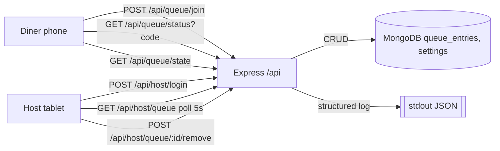

# Feature: Place in Line — Technical Design

Issue: [#1](https://github.com/mathursrus/SKB/issues/1)
Owner: Claude (agent)
Spec: [docs/feature-specs/1-place-in-line.md](../feature-specs/1-place-in-line.md)

## Customer

- Walk-in diner at Shri Krishna Bhavan (phone, no login).
- Host operator at the front desk (tablet, PIN-gated).

## Customer Problem being solved

Diners leave or get rejected because wait time is opaque and the host's mental/paper queue drops parties. We need a shared, server-computed queue with transparent ETAs.

## User Experience that will solve the problem

### Diner (mobile web)
1. Scan QR at the door → `GET /queue` page.
2. Page shows line length + ETA for a new party, join form.
3. Submit join form → `POST /api/queue/join` → receive `{position, eta, code}` → render confirmation card.
4. Refresh page → `GET /api/queue/status?code=SKB-7Q3` returns current `{position, eta, state}`.

### Operator (tablet, PIN-gated)
1. Open `/host` → PIN gate → on success, store signed cookie → render queue.
2. Poll `GET /api/host/queue` every 5s → table re-renders.
3. Tap Remove on a row → `POST /api/host/queue/:id/remove` with `{reason: "seated"|"no_show"}` → list refetch.
4. Adjust avg turn-time → `POST /api/host/settings` → ETAs recompute.

## Technical Details

### UI changes
Pure static HTML + vanilla JS served by Express (no Next.js yet — ship fast for a single-page flow; we can migrate when a second surface appears). Add:

- `public/queue.html` — diner page (renders from the two `/api/queue/*` endpoints)
- `public/host.html` — host-stand page (polls `/api/host/queue`, calls remove/settings)
- `public/styles.css` — shared CSS extracted from the mocks
- `public/queue.js`, `public/host.js` — vanilla fetch handlers

Express serves `public/` via `express.static`. Mocks at `docs/feature-specs/mocks/` become the source-of-truth visuals; `public/*.html` are their functional clones.

### API surface (OpenAPI-ish)

| Method | Path | Auth | Body / Query | Response |
|---|---|---|---|---|
| GET | `/api/queue/state` | none | — | `{ partiesWaiting: number, etaForNewPartyMinutes: number, avgTurnTimeMinutes: number }` |
| POST | `/api/queue/join` | none | `{ name, partySize, phoneLast4? }` | `{ code, position, etaAt: ISO8601, etaMinutes: number }` |
| GET | `/api/queue/status` | none | `?code=SKB-7Q3` | `{ code, position, etaAt, state: "waiting"\|"called"\|"seated"\|"no_show"\|"not_found" }` |
| GET | `/api/host/queue` | host cookie | — | `{ parties: Party[], oldestWaitMinutes, avgTurnTimeMinutes }` |
| POST | `/api/host/queue/:id/remove` | host cookie | `{ reason: "seated"\|"no_show" }` | `{ ok: true }` |
| POST | `/api/host/settings` | host cookie | `{ avgTurnTimeMinutes: number }` | `{ avgTurnTimeMinutes }` |
| POST | `/api/host/login` | none | `{ pin }` | sets `skb_host` cookie, `{ ok: true }` |
| POST | `/api/host/logout` | host cookie | — | clears cookie |

Validation rules:
- `name`: 1–60 chars, trimmed.
- `partySize`: integer 1–10.
- `phoneLast4`: optional, 4 digits or empty.
- `pin`: compared to `SKB_HOST_PIN` env via `crypto.timingSafeEqual`.
- `avgTurnTimeMinutes`: integer 1–60.

### Data model / schema (MongoDB)

Database: `skb_dev` / `skb_prod` / `skb_issue_<n>` per `git-utils.determineDatabaseName()`.

**Collection: `queue_entries`**
```ts
interface QueueEntry {
  _id: ObjectId;
  code: string;                 // e.g., "SKB-7Q3", unique, 6 chars
  name: string;
  partySize: number;            // 1..10
  phoneLast4?: string;          // 4 digits
  state: "waiting" | "called" | "seated" | "no_show";
  joinedAt: Date;
  removedAt?: Date;
  removedReason?: "seated" | "no_show";
  serviceDay: string;           // "YYYY-MM-DD" in America/Los_Angeles; used for EOD partitioning
}
```
Indexes:
- `{ serviceDay: 1, state: 1, joinedAt: 1 }` — the hot read path (ordered waiting list for today).
- `{ code: 1 }` unique — diner status lookup.

**Collection: `settings`** (single document)
```ts
interface Settings {
  _id: "global";
  avgTurnTimeMinutes: number;   // default 8
  updatedAt: Date;
}
```

ETA formula (server-side, authoritative):
```
position_1_based  = count(waiting entries ahead) + 1
etaMinutes        = position_1_based * avgTurnTimeMinutes
etaAt             = entry.joinedAt + etaMinutes  // for diner view, based on current time: now + etaMinutes
```
For the diner's running view we use `now + (position × avgTurnTimeMinutes)` so the promised time shifts earlier as the line moves.

### Failure modes & timeouts
| Failure | Behavior |
|---|---|
| MongoDB unavailable | Endpoints return 503; diner page shows "temporarily unavailable, ask the host." |
| Duplicate code collision (astronomically rare) | Retry code generation up to 5x, then 500. |
| PIN env var unset | `/api/host/login` returns 503 "host auth not configured"; surface to logs. |
| Invalid party size / missing name | 400 with field-level error; diner form shows inline error. |
| `?code=` not found | 200 `{state: "not_found"}` (not 404 — avoids info leak and simplifies client). |
| Request body > 10KB | 413 (Express default with our json limit). |

Timeouts: server-side Mongo operations capped at 3s (`maxTimeMS: 3000`); HTTP client side uses native fetch default.

### Telemetry & analytics
No third-party analytics (compliance rule). Structured server logs only:
- `log.info("queue.join", { code, partySize, position })`
- `log.info("queue.remove", { code, reason, position, waitedMinutes })`
- `log.warn("host.auth.fail", { ip })`
- `log.error("db.error", { op, err })`

Logger: `console.log(JSON.stringify({ t: now, level, msg, ...ctx }))` — no dependency, structured, greppable.

## Confidence Level

**90/100.** Standard Express + MongoDB CRUD, well-trodden patterns. The 10% uncertainty is split between (a) operator real-world usage — they might want SMS call-outs sooner than planned — and (b) ETA tuning in practice vs. the simple `position × turn_time` model.

## Validation Plan

| User Scenario | Expected outcome | Validation method |
|---|---|---|
| Diner with empty line joins | `position: 1`, `etaMinutes = avgTurnTime` | API + unit |
| 3 parties in line, host removes position 1 as seated | Pos 2→1, Pos 3→2; ETAs shifted earlier by `avgTurnTime` | API + unit |
| Diner reloads `/queue/status?code=…` after removal | `position` decreases, `etaAt` moves earlier | API + e2e |
| Host opens `/host` with wrong PIN | 401; queue not shown | API |
| Join with `partySize: 0` | 400 field error; entry not created | API + unit |
| Mongo down | 503 from all `/api/*` routes; no process crash | Integration (mongo stopped) |
| Same serviceDay rollover at midnight | Entries from yesterday excluded from today's listing | Unit (time-frozen) |

**Design-standards validation**: `public/*.html` compared against `docs/feature-specs/mocks/*.html` by eye and via headless snapshot at 375×812 (diner) and 1024×768 (host). No overlap, CTAs tappable, contrast ≥ 4.5:1.

## Test Matrix

### Unit (mocking ok)
- `src/services/queue.ts` — `computePosition`, `computeEta`, `recomputeAfterRemoval`. Test suite: new `tests/queue.test.ts`.
- `src/services/codes.ts` — `generateCode` uniqueness + format `SKB-XXX`. Test suite: new `tests/codes.test.ts`.
- `src/services/serviceDay.ts` — TZ rollover at midnight PT. Test suite: new `tests/serviceDay.test.ts`.

### Integration (real Mongo, no external mocks; uses `skb_issue_<n>` DB)
- `tests/queue.integration.test.ts` — join, recompute on remove, status-by-code, EOD partition, unique-code index.
- `tests/host-auth.integration.test.ts` — PIN success/fail, cookie set/clear.

### E2E (1 test, no mocking)
- `e2e/queue.e2e.test.ts` — spins MCP server + REST routes; joins 3 parties via REST, removes one via host endpoint, verifies diner `/status?code=` reflects position shift and ETA movement. Reuses `tests/shared-server-utils.ts`.

## Risks & Mitigations

| Risk | Severity | Mitigation |
|---|---|---|
| PIN in env var leaks to logs | Medium | Never log `req.body.pin`; redact body in request log middleware. |
| Same `code` collision | Low | Unique index + retry loop on insert. |
| Operator closes browser with stale queue open | Medium | 5s client poll, plus last-updated timestamp in header. |
| Turn-time miscalibration → angry customers | Medium | Host can adjust `avgTurnTimeMinutes` live; future: compute rolling avg from removed-seated entries. |
| Abuse: someone joins 50 fake parties | Medium | Per-IP rate limit on `/api/queue/join` (in-memory token bucket, 5 joins / 10 min). |
| SSR timezone != host timezone | Low | Fix `TZ=America/Los_Angeles` in env; `serviceDay` always computed in PT. |

## Spike Findings (if applicable)

N/A — all pieces (Express, MongoDB driver, vanilla HTML) are well-understood.

## Observability (logs, metrics, alerts)

- **Logs**: structured JSON on stdout (see Telemetry above).
- **Metrics** (v1 deferred): if we later add a Prom endpoint, expose `queue_waiting_gauge`, `queue_join_total`, `queue_remove_total{reason}`, `host_auth_fail_total`.
- **Alerts** (v1 deferred): N/A; single-location, host observes the app directly.
- **Health**: existing `/health` covers liveness; add `/health/db` that pings Mongo with 1s timeout for readiness.

## Design Standards Applied

Generic UI baseline. Constraints captured:
- Mobile-first; single column under 600px.
- Tap targets ≥ 44px.
- High contrast (≥ 4.5:1 body text).
- System fonts; ≤ 2 font sizes per screen (heading, body).
- Mocks at `docs/feature-specs/mocks/` are the visual source; `public/*.html` must match within 10% visual delta.

## Component Hierarchy (server)

```
src/
├── mcp-server.ts           (existing; app entry, wires routes + static)
├── core/
│   ├── utils/
│   │   ├── git-utils.ts    (existing)
│   │   └── time.ts         (NEW — nowPT, serviceDay)
│   └── db/
│       └── mongo.ts        (NEW — singleton client, getDb())
├── services/
│   ├── queue.ts            (NEW — join, list, remove, recomputeEtas)
│   ├── codes.ts            (NEW — generateCode, reserved set)
│   └── settings.ts         (NEW — getAvgTurnTime, setAvgTurnTime)
├── routes/
│   ├── queue.ts            (NEW — /api/queue/*)
│   ├── host.ts             (NEW — /api/host/*)
│   └── health.ts           (NEW — extract /health + add /health/db)
├── middleware/
│   ├── hostAuth.ts         (NEW — cookie verify + PIN compare)
│   └── rateLimit.ts        (NEW — per-IP in-memory bucket)
├── issues.ts               (existing)
└── types/
    └── queue.ts            (NEW — QueueEntry, Settings, API DTOs)

public/
├── queue.html, queue.js    (NEW)
├── host.html, host.js      (NEW)
└── styles.css              (NEW)
```

New dependency: `cookie` (tiny) + `cookie-parser` or manually. Plan: manual `Set-Cookie` writing + signed HMAC payload to avoid adding `cookie-parser`. Signing secret: `SKB_COOKIE_SECRET` env.

## Architecture Analysis

No project architecture document exists yet (`create-architecture` job not run). Every pattern this RFC introduces is therefore in the **Missing from Architecture** bucket by definition. Listing them so they can be promoted into an architecture doc later.

### Patterns Correctly Followed
- **Issue-based port allocation** — RFC reuses `getPort()` from `src/core/utils/git-utils.ts` (scaffold).
- **Branch-based database naming** — RFC reuses `determineDatabaseName()` from `src/core/utils/git-utils.ts`.
- **Structured stdout logging** — RFC extends the scaffold's console logging pattern with JSON shape.

### Patterns Missing from Architecture (should be codified)
| Pattern | Why it's needed | Suggested doc location |
|---|---|---|
| `src/routes/*.ts` as Express route modules, wired in `mcp-server.ts` | Keeps MCP and REST concerns separated; scales to more endpoints | `docs/architecture/architecture.md` § Layers |
| `src/services/*.ts` for domain logic with no HTTP awareness | Keeps HTTP handlers thin, makes services unit-testable | same |
| MongoDB singleton via `src/core/db/mongo.ts#getDb()` | Avoids per-request connection churn; single source of DB name | same |
| Service-day partitioning for daily-scoped data (`serviceDay: "YYYY-MM-DD"` in PT) | Avoids destructive midnight resets; queries filter by day | same |
| HMAC-signed cookies for lightweight auth (`SKB_COOKIE_SECRET` env) | PIN gate without auth-lib dependency | same |
| Per-IP in-memory rate limits | Protects public endpoints without Redis | same |
| Timezone pinning (`TZ=America/Los_Angeles`) | Prevents host/diner clock-skew in `serviceDay` | same |
| Secrets via env only (`SKB_HOST_PIN`, `SKB_COOKIE_SECRET`, `MONGODB_URI`) | Matches project rule 6 (never commit secrets) | `docs/architecture/architecture.md` § Security |

### Patterns Incorrectly Followed
None — no prior architecture doc to contradict.

### Recommendation
After implementation lands, run `create-architecture` to capture the above in `docs/architecture/architecture.md` as the canonical reference.

## Data Flow (Level-1)


