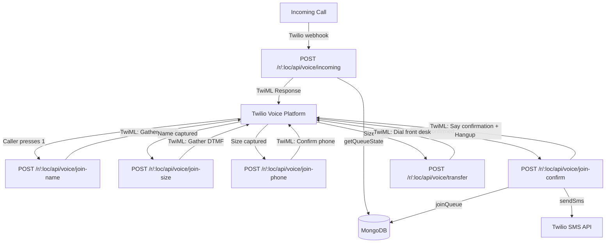

# Feature: Phone System Integration of Wait List

Issue: #31
Owner: Claude (AI Employee)

## Customer

Diners who prefer to call rather than use a website, and restaurant hosts who want to capture phone-based demand without manual data entry.

## Customer Problem Being Solved

Joining the waitlist requires a smartphone and web access. Phone callers — older diners, drivers, phone-first customers — cannot check the wait or join. See [feature spec](../feature-specs/31-phone-system-integration-of-wait-list.md) for full problem statement.

## User Experience That Will Solve the Problem

1. Diner calls the SKB phone number → hears greeting with current wait status
2. Presses 1 → speaks their name → enters party size on keypad
3. System confirms Caller ID phone number (or accepts manual entry)
4. System joins the diner to the waitlist via the existing `joinQueue()` service
5. System reads back position, ETA, and pickup code → sends SMS confirmation
6. Host sees the phone-joined party on the dashboard identically to web joiners

Full UX flows in the [feature spec](../feature-specs/31-phone-system-integration-of-wait-list.md#user-experience-that-will-solve-the-problem).

## Technical Details

### Architecture Overview



### Stateless Webhook Flow

Twilio Voice uses a **stateless webhook model**: each step in the IVR is a separate HTTP POST. State (caller name, party size, phone) is passed between steps via URL query parameters in the TwiML `action` attribute.

| Step | Webhook Endpoint | Input | State Passed Forward | TwiML Output |
|------|-----------------|-------|---------------------|-------------|
| 1 | `POST /r/:loc/api/voice/incoming` | Twilio call metadata (`From`, `To`, `CallSid`) | — | `<Gather>` DTMF menu (1=join, 2=repeat) |
| 2 | `POST /r/:loc/api/voice/menu-choice` | `Digits` (1 or 2) | — | If 1→redirect to join-name. If 2→redirect to incoming. |
| 3 | `POST /r/:loc/api/voice/join-name` | — | `from` (Caller ID) | `<Gather input="speech">` for name |
| 4 | `POST /r/:loc/api/voice/join-size` | `SpeechResult` (name) | `from`, `name` | `<Gather input="dtmf" finishOnKey="#">` for party size |
| 5 | `POST /r/:loc/api/voice/join-phone` | `Digits` (party size) | `from`, `name`, `size` | If size>10→transfer. Else→`<Gather>` confirm phone |
| 6a | `POST /r/:loc/api/voice/join-confirm` | `Digits` (1=confirm, 2=enter new) | `from`, `name`, `size`, `phone` | If 1→join+confirm. If 2→prompt for phone entry |
| 6b | `POST /r/:loc/api/voice/enter-phone` | — | `name`, `size` | `<Gather input="dtmf" finishOnKey="#" numDigits="10">` |
| 6c | `POST /r/:loc/api/voice/join-confirm` | `Digits` (manual phone) | `name`, `size`, `phone` | Join+confirm |
| 7 | `POST /r/:loc/api/voice/transfer` | — | — | `<Dial>` front desk number |

**State passing mechanism**: Query parameters on `action` URLs.
```
action="/r/skb/api/voice/join-size?name=John&from=2065551234"
```
URL-encode the name to handle spaces and special characters.

### New File: `src/routes/voice.ts`

Voice route handler. Follows the same pattern as `queue.ts` and `host.ts` — an exported factory function returning an Express Router.

```typescript
// src/routes/voice.ts

import { Router, type Request, type Response } from 'express';
import { getQueueState, joinQueue } from '../services/queue.js';
import { sendSms } from '../services/sms.js';
import { joinConfirmationMessage } from '../services/smsTemplates.js';
import { getLocation } from '../services/locations.js';
import { spellOutCode, spellOutPhone, formatEtaForSpeech } from '../services/voiceTemplates.js';

function loc(req: Request): string {
    return String(req.params.loc ?? 'skb');
}

/** Generate TwiML XML response */
function twiml(body: string): string {
    return `<?xml version="1.0" encoding="UTF-8"?><Response>${body}</Response>`;
}

export function voiceRouter(): Router {
    const r = Router({ mergeParams: true });

    // Step 1: Incoming call — greeting + menu
    r.post('/voice/incoming', async (req: Request, res: Response) => {
        try {
            const state = await getQueueState(loc(req));
            const eta = formatEtaForSpeech(state.etaForNewPartyMinutes);
            res.type('text/xml').send(twiml(`
                <Gather input="dtmf" numDigits="1" timeout="10"
                        action="/r/${loc(req)}/api/voice/menu-choice">
                    <Say voice="Polly.Joanna">
                        Hello, and thank you for calling ${await locationName(req)}.
                        There are currently ${state.partiesWaiting} parties ahead of you,
                        with an estimated wait of ${eta}.
                        To add your name to the waitlist, press 1.
                        To hear the wait time again, press 2.
                        Or hang up at any time.
                    </Say>
                </Gather>
                <Say>Thank you for calling. Goodbye!</Say>
                <Hangup/>
            `));
        } catch (err) {
            console.log(JSON.stringify({ t: new Date().toISOString(), level: 'error', msg: 'voice.incoming.error', error: String(err) }));
            res.type('text/xml').send(twiml(`
                <Say>We're sorry, we're experiencing a technical issue. Please try again later. Goodbye!</Say>
                <Hangup/>
            `));
        }
    });

    // Step 2: Menu choice (1=join, 2=repeat)
    r.post('/voice/menu-choice', async (req: Request, res: Response) => { /* ... */ });

    // Step 3: Collect name via speech
    r.post('/voice/join-name', async (req: Request, res: Response) => { /* ... */ });

    // Step 4: Collect party size via DTMF
    r.post('/voice/join-size', async (req: Request, res: Response) => { /* ... */ });

    // Step 5: Confirm phone number
    r.post('/voice/join-phone', async (req: Request, res: Response) => { /* ... */ });

    // Step 6a: Process confirmation (join or enter new phone)
    r.post('/voice/join-confirm', async (req: Request, res: Response) => { /* ... */ });

    // Step 6b: Manual phone entry
    r.post('/voice/enter-phone', async (req: Request, res: Response) => { /* ... */ });

    // Step 7: Transfer to front desk
    r.post('/voice/transfer', async (req: Request, res: Response) => { /* ... */ });

    return r;
}

async function locationName(req: Request): Promise<string> {
    try {
        const location = await getLocation(loc(req));
        return location?.name ?? 'the restaurant';
    } catch {
        return 'the restaurant';
    }
}
```

### New File: `src/services/voiceTemplates.ts`

Speech output helpers — analogous to `smsTemplates.ts` for voice.

```typescript
// src/services/voiceTemplates.ts

/** Spell out a pickup code for voice: "SKB-7Q3" → "S, K, B, dash, 7, Q, 3" */
export function spellOutCode(code: string): string {
    return code.split('').map(ch => {
        if (ch === '-') return 'dash';
        return ch;
    }).join(', ');
}

/** Spell out a phone number for voice: "2065551234" → "2, 0, 6, 5, 5, 5, 1, 2, 3, 4" */
export function spellOutPhone(phone: string): string {
    return phone.split('').join(', ');
}

/** Format ETA for speech: 48 → "about 48 minutes", 0 → "less than a minute" */
export function formatEtaForSpeech(minutes: number): string {
    if (minutes <= 0) return 'less than a minute';
    if (minutes === 1) return 'about 1 minute';
    return `about ${minutes} minutes`;
}

/** Strip +1 country code from Twilio From: "+12065551234" → "2065551234" */
export function normalizeCallerPhone(from: string | undefined): string {
    if (!from) return '';
    const cleaned = from.replace(/\D/g, '');
    // Remove leading 1 if 11 digits (US country code)
    if (cleaned.length === 11 && cleaned.startsWith('1')) {
        return cleaned.slice(1);
    }
    return cleaned;
}
```

### New File: `src/middleware/twilioValidation.ts`

Webhook signature validation to prevent unauthorized TwiML requests.

```typescript
// src/middleware/twilioValidation.ts

import type { Request, Response, NextFunction } from 'express';
import twilio from 'twilio';

/**
 * Express middleware that validates Twilio webhook signatures.
 * Skips validation if TWILIO_AUTH_TOKEN is not set (development mode).
 */
export function validateTwilioSignature(req: Request, res: Response, next: NextFunction): void {
    const authToken = process.env.TWILIO_AUTH_TOKEN;
    if (!authToken) {
        // In development/test, skip validation
        next();
        return;
    }

    const signature = req.headers['x-twilio-signature'] as string;
    const url = `${req.protocol}://${req.get('host')}${req.originalUrl}`;
    const isValid = twilio.validateRequest(authToken, signature, url, req.body);

    if (!isValid) {
        console.log(JSON.stringify({
            t: new Date().toISOString(), level: 'warn',
            msg: 'voice.invalid_signature', url,
        }));
        res.status(403).send('Forbidden');
        return;
    }
    next();
}
```

### Registration in `src/mcp-server.ts`

```diff
 import { queueRouter } from './routes/queue.js';
 import { hostRouter } from './routes/host.js';
 import { healthRouter } from './routes/health.js';
+import { voiceRouter } from './routes/voice.js';

+// URL-encoded body parser for Twilio webhooks (application/x-www-form-urlencoded)
+app.use(express.urlencoded({ extended: false }));

 // Per-location routes: /r/:loc/...
 app.use('/r/:loc/api', queueRouter());
 app.use('/r/:loc/api', hostRouter());
+
+// Voice IVR routes (conditionally enabled)
+if (process.env.TWILIO_VOICE_ENABLED === 'true') {
+    app.use('/r/:loc/api', voiceRouter());
+    console.log('[MCP Server] Voice IVR enabled');
+}
```

**Important**: Twilio sends webhooks as `application/x-www-form-urlencoded`, not JSON. The `express.urlencoded()` middleware must be added to parse `req.body` correctly.

### Data Model / Schema Changes

**No schema changes required.** Phone-joined parties use the exact same `QueueEntry` interface as web-joined parties. The `joinQueue()` function accepts `{ name, partySize, phone }` identically.

#### Location Model Extension (Optional)

To support front desk transfer and per-location voice configuration:

```diff
 // src/types/queue.ts
 export interface Location {
     _id: string;
     name: string;
     pin: string;
+    frontDeskPhone?: string;    // e.g., "2065559999" — for IVR transfer (R5a)
     createdAt: Date;
 }
```

This is an **additive** change — existing locations without `frontDeskPhone` still work. The voice route checks for this field and falls back to a "please try online" message if not configured.

### API Surface Changes

All new endpoints. No changes to existing API.

| Method | Endpoint | Content-Type | Auth | Purpose |
|--------|----------|-------------|------|---------|
| POST | `/r/:loc/api/voice/incoming` | `application/x-www-form-urlencoded` | Twilio signature | IVR entry point — greeting + menu |
| POST | `/r/:loc/api/voice/menu-choice` | `application/x-www-form-urlencoded` | Twilio signature | Process menu selection |
| POST | `/r/:loc/api/voice/join-name` | `application/x-www-form-urlencoded` | Twilio signature | Gather name (speech) |
| POST | `/r/:loc/api/voice/join-size` | `application/x-www-form-urlencoded` | Twilio signature | Gather party size (DTMF) |
| POST | `/r/:loc/api/voice/join-phone` | `application/x-www-form-urlencoded` | Twilio signature | Confirm or enter phone |
| POST | `/r/:loc/api/voice/join-confirm` | `application/x-www-form-urlencoded` | Twilio signature | Join queue + confirm |
| POST | `/r/:loc/api/voice/enter-phone` | `application/x-www-form-urlencoded` | Twilio signature | Manual phone entry |
| POST | `/r/:loc/api/voice/transfer` | `application/x-www-form-urlencoded` | Twilio signature | Transfer to front desk |

**Response format**: All endpoints return `text/xml` (TwiML), not JSON.

### Environment Variables

```diff
 # .env.example

 # SMS (Twilio)
 TWILIO_ACCOUNT_SID=
 TWILIO_AUTH_TOKEN=
 TWILIO_PHONE_NUMBER=
+
+# Voice IVR (requires SMS vars above + this flag)
+TWILIO_VOICE_ENABLED=          # "true" to enable voice routes (default: disabled)
```

No additional Twilio credentials needed — voice uses the same `TWILIO_ACCOUNT_SID` and `TWILIO_AUTH_TOKEN` as SMS. The `TWILIO_PHONE_NUMBER` is both the SMS sender and the voice endpoint (configured in Twilio console to point webhooks at our server).

### Twilio Console Configuration

For each location, configure the Twilio phone number's **Voice webhook** to:
- **URL**: `https://{host}/r/{loc}/api/voice/incoming`
- **Method**: POST
- **Fallback URL**: (optional) same URL — Twilio retries on failure

### UI Changes

**None.** This feature is entirely voice-based. No changes to `queue.html`, `host.html`, or any frontend JavaScript.

### Design Standards

Generic UI baseline. No visual changes. Voice output uses Twilio's `Polly.Joanna` voice (AWS Polly, English US, neural).

### Failure Modes & Timeouts

| Failure | Behavior | Timeout |
|---------|----------|---------|
| `getQueueState()` fails (DB down) | IVR says "experiencing technical issues, try again later" + hangup | Existing MongoDB timeout |
| Speech recognition returns empty | Retry up to 2 times. After 2 failures: "please try online" + hangup | Twilio `<Gather>` timeout: 5s per attempt |
| `joinQueue()` fails (DB error, code collision exhausted) | IVR says "technical issue, try online or call back" + hangup | Existing MongoDB timeout |
| SMS fails after phone join | Join still succeeds. Verbal confirmation already gave the code. SMS failure logged. | Twilio SMS timeout (5s recommended) |
| Twilio signature validation fails | 403 Forbidden returned. Call hears Twilio default error. | N/A |
| Caller hangs up mid-flow | Twilio terminates webhooks. No queue entry created (join hasn't happened yet). | N/A |
| Invalid Caller ID (blocked/anonymous) | System prompts for manual 10-digit phone entry via keypad. | `<Gather>` timeout: 15s |
| Front desk phone not configured | IVR says "we can't transfer, please call back" + hangup | N/A |
| Front desk doesn't answer | Twilio `<Dial>` timeout (30s default), then fallback TwiML | 30s |

### Telemetry & Analytics

Structured JSON logging following existing pattern:

```
{ t, level: "info",  msg: "voice.incoming",      loc: "skb", from: "******1234" }
{ t, level: "info",  msg: "voice.join.start",     loc: "skb", name: "John", partySize: 3 }
{ t, level: "info",  msg: "voice.join.complete",   loc: "skb", code: "SKB-7Q3", position: 6 }
{ t, level: "info",  msg: "voice.transfer",        loc: "skb", reason: "large_party", size: 15 }
{ t, level: "warn",  msg: "voice.speech_failed",   loc: "skb", attempt: 2 }
{ t, level: "error", msg: "voice.join.error",      loc: "skb", error: "..." }
{ t, level: "warn",  msg: "voice.invalid_signature", url: "..." }
{ t, level: "info",  msg: "voice.goodbye",         loc: "skb", reason: "timeout" }
```

Phone numbers in voice logs are masked using the existing `maskPhone()` function.

## Confidence Level

**80/100**

High confidence because:
- Twilio TwiML is well-documented and widely used for IVR
- The existing `joinQueue()` and `sendSms()` services are reused without modification
- Architecture is stateless webhooks — no new infrastructure, no WebSockets, no persistent state
- Follows the exact same Express Router pattern as existing routes

Remaining 20% uncertainty:
- **Speech recognition accuracy for names** (10%): Twilio's `<Gather input="speech">` may struggle with uncommon names, accents, or noisy environments. Mitigated by the existing retry mechanism (R12).
- **URL-encoded body parsing compatibility** (5%): Adding `express.urlencoded()` alongside `express.json()` — need to verify no conflicts with existing JSON endpoints.
- **Twilio webhook URL construction** (5%): The `action` URLs in TwiML need to include the full path with `:loc` parameter. Need to ensure URL construction is correct behind proxies/load balancers.

## Validation Plan

| User Scenario | Expected Outcome | Validation Method |
|---------------|------------------|-------------------|
| Call Twilio number → hear greeting | Greeting plays with current wait count and ETA | Phone call + API test (POST /voice/incoming) |
| Press 1 → say name → enter size | System captures name and party size | API test (POST /voice/join-name, /voice/join-size) |
| Confirm phone → join | Queue entry created, SMS sent, confirmation read | API + DB validation |
| Press 2 → repeat status | Updated wait status plays | API test (POST /voice/menu-choice with Digits=2) |
| Timeout → goodbye | Goodbye message plays | API test (POST /voice/incoming without Gather response) |
| Party size > 10 → transfer | Call transferred to front desk | API test (verify `<Dial>` in TwiML response) |
| Blocked Caller ID → enter phone | Manual phone entry prompt | API test (POST with empty From) |
| DB error during join | Error message + hangup | API test (mock DB failure) |
| Speech recognition fails | Retry prompt, then fallback | API test (POST /voice/join-size without SpeechResult) |
| Invalid Twilio signature | 403 Forbidden | API test (POST without valid signature header) |
| `TWILIO_VOICE_ENABLED=false` | Voice routes return 404 | API test (GET /voice/incoming → 404) |
| Phone joiner on host dashboard | Appears same as web joiner | Browser validation — host sees party in queue |

## Test Matrix

### Unit Tests (no external dependencies)

| Test Suite | What's Tested |
|-----------|---------------|
| `tests/unit/voiceTemplates.test.ts` (NEW) | `spellOutCode()`, `spellOutPhone()`, `formatEtaForSpeech()`, `normalizeCallerPhone()` — all pure functions |
| `tests/unit/twilioValidation.test.ts` (NEW) | Signature validation middleware: valid sig → next(), invalid sig → 403, missing auth token → skip |

### Integration Tests (mock Twilio, real MongoDB)

| Test Suite | What's Tested |
|-----------|---------------|
| `tests/integration/voice.integration.test.ts` (NEW) | Full IVR flow: incoming → menu → name → size → phone → confirm → verify queue entry in DB. Tests: greeting with correct count, menu routing (1 and 2), party size validation (1-10 pass, 11-20 transfer, >20 error), phone confirmation and manual entry, blocked Caller ID, speech failure retry, DB error handling, feature gate (TWILIO_VOICE_ENABLED) |

### E2E Tests (no mocking)

| Test Suite | What's Tested |
|-----------|---------------|
| No new E2E tests | Voice E2E would require actual phone calls. Not practical for CI. Validation via manual phone testing against staging. |

## Risks & Mitigations

| Risk | Likelihood | Impact | Mitigation |
|------|-----------|--------|-----------|
| Speech recognition misunderstands name | Medium | Low (wrong name in queue, host can update) | Retry mechanism (R12). Names are informational only — code is the real identifier. |
| `express.urlencoded()` conflicts with `express.json()` | Low | Medium (breaks existing JSON endpoints) | Express handles both based on Content-Type. Add integration test verifying JSON endpoints still work after adding urlencoded parser. |
| Twilio webhook URL incorrect behind proxy | Medium | Medium (IVR flow breaks mid-call) | Use `req.originalUrl` for path, respect `X-Forwarded-*` headers. Test with and without proxy. |
| Front desk phone not configured | Medium | Low (caller can't transfer) | Graceful fallback: "We can't transfer you right now. Please try calling back." Check `location.frontDeskPhone` before attempting `<Dial>`. |
| Twilio credentials compromised via webhook | Low | High (unauthorized queue entries) | Twilio signature validation middleware on all voice routes. Rate limiting at Twilio level. |
| Voice costs unexpectedly high | Low | Low (~$0.013/min) | Monitor via Twilio dashboard. Feature gate allows quick disable. |
| State loss between webhook steps | Low | Medium (IVR flow breaks) | State in URL query params. Integration tests verify full flow state preservation. |

## Spike Findings

No spike was needed. All technologies used are either already integrated (Twilio SDK, Express) or have Low uncertainty (TwiML generation is string templating, `<Gather>` is well-documented).

The Issue #29 spike (Twilio SDK for SMS) validated the core Twilio integration — account setup, credential management, and SDK behavior. Voice TwiML uses the same account and a different API surface (webhook-based, not SDK-based).

## Architecture Analysis

### Patterns Correctly Followed
- **Service layer separation**: New `voiceTemplates.ts` follows `smsTemplates.ts` pattern. Voice routes call existing services (`queue.ts`, `sms.ts`).
- **Multi-tenant scoping**: Voice routes use the same `:loc` URL parameter as all other routes.
- **Structured JSON logging**: Voice events use the same `{ t, level, msg }` pattern.
- **Environment variable config**: `TWILIO_VOICE_ENABLED` follows existing `TWILIO_*` env var pattern with graceful fallback.
- **Feature gating**: Conditional route registration (not runtime checks) — cleaner than checking on every request.
- **Error isolation**: Voice route errors never affect existing queue/host routes.

### New Patterns Introduced
- **TwiML response type**: Voice routes return `text/xml` instead of `application/json`. This is a new response type in the codebase but is an established Twilio pattern.
- **URL-encoded body parsing**: Twilio sends `application/x-www-form-urlencoded`. Adding `express.urlencoded()` is standard Express middleware.
- **Webhook signature validation**: First inbound webhook validation in the codebase (SMS was outbound-only). Introduces `twilioValidation.ts` middleware.
- **Stateless state passing**: URL query params for IVR state. Simple but requires URL-encoding for names with special characters.

### Patterns Missing from Architecture (Need Documentation)
- **Inbound webhook security pattern**: This is the first inbound webhook. The signature validation approach should be documented as the baseline for future webhook integrations.

## Observability (logs, metrics, alerts)

- **Structured JSON logs**: All voice events logged with consistent format (see Telemetry section)
- **No new metrics endpoints**: Voice call counts derivable from `voice.incoming` log entries
- **Alert recommendation**: Monitor `voice.join.error` and `voice.speech_failed` frequencies. Alert if > 30% of calls fail to complete a join (indicates speech recognition or system issues).
- **Debug**: Twilio `CallSid` available in all webhook requests for cross-referencing with Twilio dashboard
