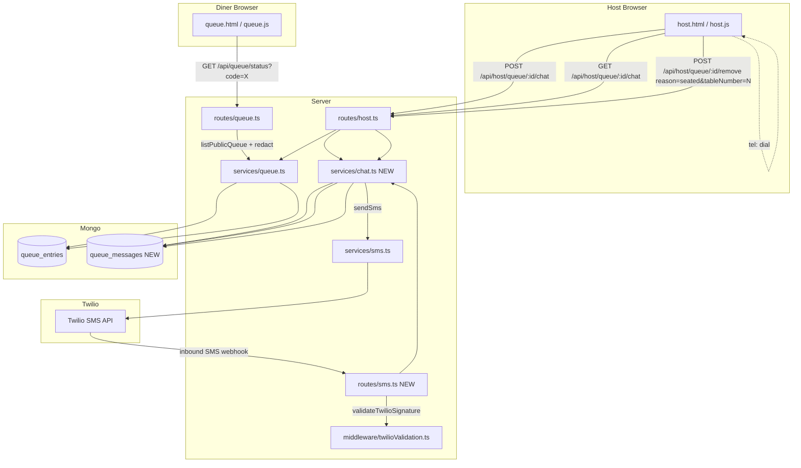

# Feature: Waitlist — Customer Full-List View, Host Chat/Call, Table Number on Seat

Issue: #37
Owner: Claude (AI Employee)
Spec: [37-waitlist-transparency-chat-table.md](../feature-specs/37-waitlist-transparency-chat-table.md)

## Customer

Diners waiting at SKB and the hosts running the stand.

## Customer Problem Being Solved

Today the customer-facing status page (`/public/queue.html`) tells a diner only their own position and a rough ETA. They can't see how long the line actually is, whether they're "next" or "fifth out," or why their wait feels longer than advertised. That drives anxious phone calls to the host and no-shows when diners over-estimate and leave the area.

Meanwhile, hosts have no in-row way to run a two-way text thread with a guest — only a one-shot "Custom SMS" compose — and no one-tap phone dialer. And when a party is seated today the host clicks **Seated**, but the physical table number is never captured, so downstream analytics can't join to POS tickets and nobody at the stand can answer "which table is the Patel party on?"

See [feature spec §1](../feature-specs/37-waitlist-transparency-chat-table.md#1-why-problem--motivation) for full problem statement.

## User Experience That Will Solve the Problem

1. **Diner status page** adds a Waitly-style live list beneath the current ETA card — every party's position, first name + last initial, size, promised time, and live elapsed wait. The viewer's own row is highlighted in place. Polls every 15s, flips to `Table ready` and then `Seated at table <N>` terminal states.
2. **Host Waiting row** grows two new buttons next to the existing actions: **Chat** (opens a two-way SMS slide-over with quick replies and an unread badge) and **Call** (one-tap `tel:` dial). The existing Custom SMS / Custom Call buttons stay.
3. **Seated button** now opens a **Seat Party** dialog with a required **Table #** input (1–999), recent-table quick-pick chips, and a conflict warning that requires explicit override if the table is already occupied.

Full UX flows and mocks in the [feature spec §3](../feature-specs/37-waitlist-transparency-chat-table.md#3-what-scope--requirements) and `docs/feature-specs/mocks/37-*.html`.

## Technical Details

### Architecture Overview



### Summary of File Changes

| File | Change |
|---|---|
| `src/types/queue.ts` | +`tableNumber?: number` on `QueueEntry`; new `ChatMessage` type; `StatusResponseDTO` extended with `queue: PublicQueueRowDTO[]` + `totalParties`; `HostPartyDTO` extended with `unreadChat: number`; new `HostSeatRequestDTO` with `tableNumber` + `override` |
| `src/types/chat.ts` (NEW) | `ChatMessage`, `ChatMessageDTO`, `ChatThreadDTO` |
| `src/services/queue.ts` | `removeParty(..., {tableNumber, override})` — validates seating reason carries a table number, checks conflict against other active entries, persists `tableNumber` alongside `seatedAt`; new `listPublicQueue(loc, serviceDay)` returning redacted rows |
| `src/services/chat.ts` (NEW) | `sendChatMessage(entryId, body)`, `getChatThread(entryId, limit)`, `appendInbound(locationId, fromPhone, body, twilioSid)`, `countUnread(entryIds[])` |
| `src/services/nameRedact.ts` (NEW) | `redactName("Patel, Sana")` → `"Sana P."`; `toPublicRow(entry, viewerCode)` |
| `src/services/stats.ts` | No change to stats shape; `tableNumber` simply flows through on entries. Future POS join uses `QueueEntry.tableNumber`. |
| `src/routes/queue.ts` | `GET /queue/status` returns full public queue when `code` is valid; new `POST /queue/acknowledge` sets `onMyWayAt` on the entry |
| `src/routes/host.ts` | Seat path accepts `tableNumber` + `override`; new `POST /host/queue/:id/chat` + `GET /host/queue/:id/chat`; `HostPartyDTO.unreadChat` populated in list responses |
| `src/routes/sms.ts` (NEW) | `POST /sms/inbound` (Twilio form-encoded), gated by `validateTwilioSignature` |
| `src/mcp-server.ts` | Register `smsRoutes`; add `express.urlencoded({extended:false})` on the `/r/:loc/api/sms` subpath for Twilio form posts |
| `public/queue.html` / `public/queue.js` | Render full waitlist list under the ETA card, highlight viewer row, poll every 15s (was 30s); new terminal states for Table-ready and Seated-at-table-N |
| `public/host.html` / `public/host.js` | Add Chat + Call buttons per row; Chat slide-over with thread + quick-replies + composer + unread badge; Seat dialog with table number input + recent-tables chips + conflict error; relabel the existing "Call" button to "Notify" (backend endpoint name stays `/call`) |
| `public/styles.css` | Reuse existing tokens; add `.drawer`, `.seat-modal`, `.rowbtn.new`, `.unread-dot` |
| `tests/unit/nameRedact.test.ts` (NEW) | Edge cases for redaction |
| `tests/unit/chat.test.ts` (NEW) | Outbound + inbound append paths |
| `tests/unit/queue.test.ts` (MODIFY) | `removeParty` with `tableNumber` + conflict + override |
| `tests/integration/queue.integration.test.ts` (MODIFY) | Status endpoint returns full redacted list |
| `tests/integration/host.integration.test.ts` (MODIFY or NEW) | Seat with tableNumber, Chat send, inbound webhook |
| `tests/e2e/waitlist-transparency.e2e.test.ts` (NEW) | Playwright: diner joins, sees full list, host seats with table 12, diner sees terminal state |

### Data Model / Schema Changes

#### `QueueEntry` (src/types/queue.ts:25-43)

```diff
 export interface QueueEntry {
     locationId: string;
     code: string;
     name: string;
     partySize: number;
     phone: string;
     state: PartyState;
     joinedAt: Date;
     promisedEtaAt: Date;
     calls?: CallRecord[];
     removedAt?: Date;
     removedReason?: RemovalReason;
     seatedAt?: Date;
+    tableNumber?: number;              // set when state→seated; 1..999
+    onMyWayAt?: Date;                  // set when diner clicks "I'm on my way" (R6)
     orderedAt?: Date;
     servedAt?: Date;
     checkoutAt?: Date;
     departedAt?: Date;
     serviceDay: string;
 }
```

No backfill — `tableNumber` is optional. Existing departed/seated entries stay as-is.

#### New: `ChatMessage` (src/types/chat.ts)

```typescript
export type ChatDirection = 'outbound' | 'inbound';

export interface ChatMessage {
    _id?: ObjectId;
    locationId: string;         // tenant slug, for multi-tenant scoping
    entryCode: string;          // joins to QueueEntry.code — stable across _id churn
    entryId: string;            // string form of QueueEntry._id at time of write
    direction: ChatDirection;
    body: string;               // the SMS text (max 1600 chars, Twilio cap)
    createdAt: Date;
    twilioSid?: string;         // Twilio message SID for outbound; MessageSid for inbound
    smsStatus?: 'sent' | 'failed' | 'not_configured';  // outbound only
    readByHostAt?: Date;        // set when the host opens the drawer for this entry
}

export interface ChatMessageDTO {
    direction: ChatDirection;
    body: string;
    at: string;                 // ISO8601
    smsStatus?: string;
}

export interface ChatThreadDTO {
    entryId: string;
    messages: ChatMessageDTO[];   // oldest → newest
    unread: number;
}
```

#### Mongo collection: `queue_messages`

```typescript
// src/core/db/mongo.ts — add to bootstrapIndexes()
await db.collection<ChatMessage>('queue_messages').createIndexes([
    { key: { locationId: 1, entryCode: 1, createdAt: 1 }, name: 'loc_code_created' },
    { key: { locationId: 1, entryCode: 1, direction: 1, readByHostAt: 1 }, name: 'unread_lookup' },
]);
```

The thread is pinned to `entryCode` (not `_id`) because `_id` churns when an entry is re-opened; `entryCode` is stable for the life of a party and for post-hoc retrieval.

#### New DTOs

```typescript
// src/types/queue.ts

export interface PublicQueueRowDTO {
    position: number;             // 1-indexed
    displayName: string;          // "Sana P." — first name + last initial
    partySize: number;
    promisedEtaAt: string;        // ISO8601
    waitingSeconds: number;       // joinedAt → now, integer seconds
    isMe: boolean;                // true if this row is the code holder
    tableNumber?: number;         // present iff state==='seated'
}

export interface StatusResponseDTO {
    code: string;
    position: number;
    etaAt: string | null;
    etaMinutes: number | null;
    state: PartyState | 'not_found';
    callsMinutesAgo: number[];
    // NEW — R1..R8
    queue: PublicQueueRowDTO[];   // full list, oldest position first
    totalParties: number;
    tableNumber?: number;         // present iff viewer is seated
}

export interface HostSeatRequestDTO {
    reason: 'seated';
    tableNumber: number;          // required when reason==='seated'
    override?: boolean;           // bypass conflict-check (default false)
}
```

`HostPartyDTO` gains one field so the host row can render the unread dot without a separate round-trip:

```diff
 export interface HostPartyDTO {
     ...
     calls: { minutesAgo: number; smsStatus: string }[];
+    unreadChat: number;           // count of inbound messages with readByHostAt == null
+    onMyWayAt?: string;           // ISO8601; set by diner "I'm on my way" ack (R6)
 }
```

`HostDiningPartyDTO` (Seated tab) gains `tableNumber` so the Seated tab row can render the assigned table as its leftmost cell (R15):

```diff
 export interface HostDiningPartyDTO {
     id: string;
     name: string;
     partySize: number;
     phoneMasked: string;
+    tableNumber: number;          // assigned at seat time; populated for every row in this tab
     state: 'seated' | 'ordered' | 'served' | 'checkout';
     seatedAt: string;
     timeInStateMinutes: number;
     totalTableMinutes: number;
 }
```

### API Surface Changes

#### `GET /r/:loc/api/queue/status?code=SKB-XXX` — extended

Today this endpoint returns the viewer's own position and ETA. It will now **also** return the full public queue for the same service day, with names redacted:

```typescript
// src/routes/queue.ts — getStatus handler
const entry = await findByCode(loc, code);
if (!entry) { res.json({ state: 'not_found', ... }); return; }

const [publicQueue, totalParties] = await listPublicQueue(loc, entry.serviceDay, code);

res.json({
    code,
    position,
    etaAt,
    etaMinutes,
    state: entry.state,
    callsMinutesAgo,
    queue: publicQueue,          // NEW
    totalParties,                // NEW
    tableNumber: entry.tableNumber,  // NEW, present iff seated
} satisfies StatusResponseDTO);
```

Server-side rate limit (R20): 1 request / 5s / `code`. Implemented via an in-memory LRU keyed on `${locationId}:${code}` → last-hit timestamp; on hit-within-window return `429 Too Many Requests` with `Retry-After: 5`. The existing diner poll cadence is 15s so the limit only bites on abusive polling.

#### New: `POST /r/:loc/api/queue/acknowledge` — "I'm on my way" (R6)

```typescript
// body: { code: string }
// Sets onMyWayAt on the QueueEntry and logs diner.ack.on_way.
// No state transition — the entry stays in 'called' state until host seats.
// Idempotent; second call within 30s is a no-op.
```

Schema add: `QueueEntry.onMyWayAt?: Date`. Not diffed above because it's a single optional timestamp; the host row will render an `On the way` pill when present so the host knows to expect the guest imminently.

#### `POST /r/:loc/api/host/queue/:id/remove` — extended for Seat

The existing endpoint already accepts `{reason: 'seated' | 'no_show'}`. It grows two fields when `reason === 'seated'`:

```diff
 const body = req.body as {
     reason: RemovalReason;
+    tableNumber?: number;     // required when reason === 'seated'
+    override?: boolean;       // bypass conflict check
 };
 if (body.reason === 'seated') {
+    if (typeof body.tableNumber !== 'number' || !Number.isInteger(body.tableNumber)
+        || body.tableNumber < 1 || body.tableNumber > 999) {
+        res.status(400).json({ error: 'tableNumber is required and must be an integer 1..999' });
+        return;
+    }
 }
 const result = await removeParty(id, body.reason, { tableNumber: body.tableNumber, override: !!body.override });
 if (result.conflict) {
     res.status(409).json({
         error: 'table_occupied',
         tableNumber: body.tableNumber,
         occupiedBy: result.conflict.partyName,
     });
     return;
 }
 res.json({ ok: true });
```

`removeParty()` (src/services/queue.ts:194) gets the new options parameter and — for `reason === 'seated'` — runs a conflict scan before the update:

```typescript
const DINING_STATES = ['seated', 'ordered', 'served', 'checkout'] as const;

if (reason === 'seated') {
    if (!options?.override) {
        const conflict = await queueEntries(db).findOne({
            locationId: entry.locationId,
            serviceDay: entry.serviceDay,
            state: { $in: DINING_STATES },
            tableNumber: options?.tableNumber,
            _id: { $ne: _id },
        });
        if (conflict) {
            return { ok: false, conflict: { partyName: conflict.name, partyId: conflict._id.toString() } };
        }
    }
    const res = await queueEntries(db).updateOne(
        { _id, state: { $in: ACTIVE_STATES } },
        { $set: {
            state: 'seated' as PartyState,
            seatedAt: now,
            tableNumber: options!.tableNumber,
        } },
    );
    return { ok: res.matchedCount === 1 };
}
```

#### New: `POST /r/:loc/api/host/queue/:id/chat` — send outbound chat

```typescript
r.post('/host/queue/:id/chat', requireHost, async (req, res) => {
    const { body } = req.body as { body: string };
    if (typeof body !== 'string' || body.trim().length === 0 || body.length > 1600) {
        res.status(400).json({ error: 'body must be 1..1600 chars' }); return;
    }
    try {
        const result = await sendChatMessage(req.params.id, body.trim());
        if (!result.ok) { res.status(404).json({ error: 'entry not found' }); return; }
        res.json({ ok: true, smsStatus: result.smsStatus, message: result.message });
    } catch (err) { dbError(res, 'host.chat.send', err); }
});
```

`sendChatMessage()` reads the entry for phone + code, calls `sendSms(entry.phone, body)`, then inserts one `queue_messages` document with `direction: 'outbound'`. Fire-and-forget would lose delivery status, so it's synchronous — same pattern as the existing `callParty()`.

#### New: `GET /r/:loc/api/host/queue/:id/chat?before=<ISO>&limit=50` — fetch thread

Returns up to `limit` messages for the entry (default 50, max 200), ordered oldest → newest, ending before the `before` cursor if present. On initial open the drawer fetches the most recent 50 (no cursor); when the host scrolls to the top of the thread the client issues a second request with `before` set to the oldest loaded message's `createdAt`, implementing lazy pagination (R21). Response shape: `{ messages: ChatMessageDTO[], unread: number, hasMore: boolean }`.

Opening the drawer posts `PATCH /host/queue/:id/chat/read` which sets `readByHostAt = now` for all inbound messages where it is unset. This keeps the unread-dot logic server-authoritative rather than relying on the host's localStorage.

#### New: `POST /r/:loc/api/sms/inbound` — Twilio webhook

```typescript
// src/routes/sms.ts
export function registerSmsRoutes(r: Router): void {
    r.post('/sms/inbound',
        express.urlencoded({ extended: false }),
        validateTwilioSignature,
        async (req, res) => {
            const from = String(req.body.From || '').replace(/^\+1/, '');
            const body = String(req.body.Body || '');
            const sid  = String(req.body.MessageSid || '');
            try {
                await appendInbound(locationFromReq(req), from, body, sid);
                // Twilio expects 200 with empty TwiML
                res.type('text/xml').send('<?xml version="1.0" encoding="UTF-8"?><Response/>');
            } catch (err) { dbError(res, 'sms.inbound', err); }
        }
    );
}
```

`appendInbound()` looks up the most recent `queue_entries` document for this `locationId + phone + serviceDay` with an active or dining state and appends an inbound `ChatMessage` pinned to that entry's `code`. If no matching party is found it still records the message (with `entryCode: null`) for audit — but we **do not** attempt to open a new thread; that's a distinct feature.

The inbound webhook URL is configured per-location in the Twilio console, pointing at `https://<public-host>/r/<loc>/api/sms/inbound`. `Location.publicUrl` already stores the base URL (src/types/queue.ts:12).

#### No backend changes for the **Call** row action

The new **Call** button is pure frontend: `<a href="tel:+1${phone}">` on the row. It does NOT hit the existing `/host/queue/:id/call` endpoint (which sends the "table ready" SMS; that's the button now labelled **Notify**). To keep a trail of who dialed when, the client issues a best-effort `POST /host/queue/:id/call-log` that just pushes a `CallRecord` with `smsStatus: 'not_configured'` and a new `type: 'phone_dial'` discriminator. This is optional; failure is silent.

### UI Changes

#### `public/queue.html` + `public/queue.js` — diner status page

| File | Change |
|---|---|
| `queue.html` | Add `<section id="full-waitlist">` below the current status card, containing a 5-col grid (`#`, Name, Size, Promised, Waiting). Header pill that swaps between Waiting / Table ready / Seated states. |
| `queue.js` | Extend `refreshStatus()` to read `queue[]` and `totalParties` from the status response; render each row via `renderPublicRow()`; add an `isMe` class for the viewer row; decrement the poll interval from 30s to 15s **only** while state is `waiting` or `called`. On state `called` the header card flips to a green `Your table is ready` card with an `I'm on my way` CTA that POSTs to `/queue/acknowledge` with the viewer's `code` (R6); button goes to a spinner then disabled with `On the way ✓`. On state `seated`, show `Seated at table ${tableNumber}` and stop polling. On state `no_show` / `departed`, show terminal card and stop polling. |
| `queue.js` | Client-side live-tick: every 1s, increment each row's waiting seconds in place (no re-fetch). Reconcile on every poll. |

No JS required for the header card to render (R8) — server renders it into the HTML on initial GET when `?code=` is present. Subsequent updates are JSON.

#### `public/host.html` + `public/host.js` — host stand

| File | Change |
|---|---|
| `host.html` | Waiting-tab row template grows 2 buttons (Chat, Call) between **Notify** (renamed from Call) and **Custom SMS**. New `<aside id="chat-drawer">` slide-over. New `<dialog id="seat-dialog">`. |
| `host.js` | `renderParty()` renders `unreadChat` as a red dot badge on the Chat button. Disable Chat + Call + Custom SMS + Custom Call + Notify when `!entry.phoneMasked`. |
| `host.js` | `onChat(entry)` opens the drawer, fetches `/host/queue/:id/chat`, marks read, subscribes to the existing 5s poll for new messages. Composer sends via `POST /host/queue/:id/chat`. Three quick replies from `smsTemplates.ts` additions (`chatAlmostReady`, `chatNeedMoreTime`, `chatLostYou`). |
| `host.js` | `onCall(entry)` replaced: the button is now `<a href="tel:+1${entry.phoneFullForDial}">`. Server sends a dial-only payload that is **only** used for this `tel:` link (see PII note below). Best-effort `POST /host/queue/:id/call-log`. |
| `host.js` | `onSeat(entry)` no longer directly POSTs — it opens `#seat-dialog`. Submit sends `POST .../remove` with `{reason:'seated', tableNumber, override?}`. On 409, re-render the dialog with the conflict alert + override button. |
| `host.js` | Relabel the existing "Call" row button to "Notify" in the UI only; backend endpoint stays `/call`. |
| `host.js` | **Accessibility (R19)**: every row button carries an `aria-label` (`"Seat ${name}"`, `"Notify ${name}"`, `"Chat with ${name}, ${unreadChat} unread"`, `"Call ${name}"`, etc.). Buttons are tabbable in row order. The chat drawer uses `role="dialog"` + `aria-labelledby` + focus trap on open, restoring focus to the Chat button on close. The seat `<dialog>` inherits native a11y from the element. Color contrast verified against `--bg / --fg / --accent / --danger` tokens at AA. |

**PII note (Call button)**: the current `HostPartyDTO.phoneMasked` hides the phone. `tel:` needs the real digits. We add a separate `phoneForDial` field on `HostPartyDTO` that is populated **only when** `requireHost` passes and **only in** the host list endpoints. Never exposed on any diner API.

```diff
 export interface HostPartyDTO {
     id: string;
     ...
     phoneMasked: string;
+    phoneForDial?: string;    // full E.164 like "+12065551234", host-only, never in diner APIs
     ...
 }
```

#### `public/styles.css`

Reuse the existing design tokens (`--bg`, `--fg`, `--accent`, `--ok`, `--danger`, Fira Sans). New class names:

- `.drawer`, `.drawer.open` for the chat slide-over (420px right-anchored, fullscreen under 640px)
- `.seat-modal` using native `<dialog>`
- `.rowbtn.new` — outlined accent ring to visually flag Chat + Call as new (removed in a follow-up PR once the team is used to them)
- `.unread-dot`

No new font, no new color tokens. Matches the feature spec's §5.1 generic baseline note.

### SMS Message Templates

```typescript
// src/services/smsTemplates.ts — additions

export function chatAlmostReadyMessage(code: string): string {
    return `SKB: Your table is almost ready — about 5 more minutes. Code ${code}.`;
}

export function chatNeedMoreTimeMessage(code: string): string {
    return `SKB: Do you need a few more minutes? Reply YES and we'll hold your spot. Code ${code}.`;
}

export function chatLostYouMessage(code: string): string {
    return `SKB: We tried to call your party and didn't see you — are you still nearby? Reply YES to keep your spot. Code ${code}.`;
}
```

### Design Standards

Generic UI baseline (no project-specific system in `fraim/config.json`). Fira Sans + the existing `--bg/--fg/--accent/--ok/--danger` tokens in `public/styles.css:10-24`. New components (`.drawer`, `.seat-modal`) follow the same radius + border conventions as the existing cards.

### Failure Modes & Timeouts

| Failure | Behavior | Timeout |
|---|---|---|
| Twilio outbound down (chat send) | `sendChatMessage` returns `{ok:true, smsStatus:'failed'}`. Message still persisted with failure status so the thread shows it. Host sees X next to the outbound bubble. | Twilio SDK default; leave as-is (matches existing `callParty`) |
| Twilio inbound webhook down | Incoming SMS is lost from our side; Twilio logs retain it. No state corruption. | N/A |
| Invalid Twilio signature | 403, message not stored. | N/A |
| Inbound SMS from phone not matching any active party | Stored with `entryCode: null`, logged as `sms.inbound.unmatched`. | N/A |
| Two hosts seat the same party race | Mongo `_id` guard on `state: { $in: ACTIVE_STATES }` — second update returns `matchedCount: 0`, surfaced as a 404-with-message. | N/A |
| Two hosts seat different parties to the same table simultaneously | Conflict check is not transactional — there's a narrow TOCTOU window. Mitigation: a best-effort post-write re-scan; on detect, log `seat.table_collision` and surface a banner on the host stand within 5s. Full transactional fix deferred (see Risks). | N/A |
| Diner polls faster than 1/5s | 429 with `Retry-After: 5`. | N/A |
| Diner link shared — third party polls someone else's status | That's by design (R1: unauthenticated link). List names are already redacted to first + initial. | N/A |

### Telemetry & Analytics

New structured log events (existing `{t, level, msg, ...}` pattern):

```
{t, level:"info",  msg:"chat.outbound",      code, to:"******1234", len, sid}
{t, level:"error", msg:"chat.outbound.failed", code, error}
{t, level:"info",  msg:"chat.inbound",       code, from:"******1234", len, sid}
{t, level:"warn",  msg:"sms.inbound.unmatched", from:"******1234"}
{t, level:"info",  msg:"host.seat",          code, tableNumber, override, seatedByPin}
{t, level:"warn",  msg:"host.seat.conflict", code, tableNumber, occupiedBy}
{t, level:"warn",  msg:"seat.table_collision", code, tableNumber, winner}  // best-effort race detection
{t, level:"info",  msg:"host.call_dial",     code}
{t, level:"info",  msg:"diner.status.rate_limited", code}
```

No new analytics endpoints. `tableNumber` simply becomes available on `QueueEntry` for any downstream consumer (e.g., a future POS join can lookup `QueueEntry` by `tableNumber + serviceDay`).

## Confidence Level

**78/100**

High confidence:
- All three asks map cleanly to the existing Express + Mongo + Twilio + vanilla-JS stack. No new infra.
- `validateTwilioSignature` middleware already exists (src/middleware/twilioValidation.ts) so inbound is a thin wiring job.
- `sendSms()` is already the one chokepoint for outbound (src/services/sms.ts:27-54).
- `removeParty()` change is local (src/services/queue.ts:194-216) and the state machine guard (`state: { $in: ACTIVE_STATES }`) already prevents the double-seat race for a single party.

22% uncertainty:
- **OQ1 (full list vs. ahead-only)** from the spec is unresolved; a late decision to ship ahead-only would simplify `listPublicQueue` but won't change the endpoint shape.
- **Table conflict TOCTOU** (two different parties, same table, same millisecond) is unlikely in practice but not fully closed by the current Mongo update. A transactional fix needs `findOneAndUpdate` with a compound `$and: [{ tableNumber: { $ne: N } }, ...]` guard on the *peer* document, which is awkward across two documents. Deferred to post-launch if collision logs show it.
- **`phoneForDial` exposure audit** — need to confirm no existing endpoint accidentally leaks the field (the DTO change is additive so it should be safe, but a grep-check is a must in code review).
- **Twilio 10DLC + inbound webhook** — outbound 10DLC was solved in #29; inbound requires the same phone number to be configured for webhook delivery in the Twilio console. Operational step, not a code risk.

## Validation Plan

| User Scenario | Expected Outcome | Validation Method |
|---|---|---|
| Diner joins, opens status link | List shows all parties, first+initial only, viewer highlighted | E2E: POST /join → open status page → assert list items |
| Viewer at position 1 | Header reads "You're next" | Unit: header renderer given position=1 |
| Host seats viewer with table 12 | Status page flips to "Seated at table 12", poll stops | E2E: host seat → wait 15s → assert terminal state |
| Diner polls faster than 1/5s | 429 Retry-After: 5 | Integration: POST /status twice in 1s → assert 429 |
| Diner clicks "I'm on my way" | `onMyWayAt` set on entry, host row shows `On the way` pill within 5s | Integration: POST /queue/acknowledge → GET /host/queue → assert `onMyWayAt` populated |
| Host scrolls chat drawer to top | Older messages load via `before` cursor | E2E: seed 120 messages → open drawer → scroll top → assert 50 more loaded |
| Host sends chat | Message appears in drawer, delivery checkmark | Integration: POST /chat → GET /chat → assert message |
| Inbound SMS arrives | Appears in drawer on next poll, unread badge on row | Integration: POST /sms/inbound (signed) → GET /chat → assert inbound |
| Inbound SMS from unknown phone | Logged, stored with `entryCode: null` | Integration: POST /sms/inbound with unknown From |
| Host seats with table already occupied | 409 with `table_occupied`, UI shows override prompt | Integration: seat two parties to same table → assert 409 |
| Host overrides conflict | Second seat succeeds, log `seat.table_collision` | Integration: override=true → assert success + log |
| Host seats without table number | 400 with validation error | Integration: POST /remove with reason=seated, no tableNumber |
| Call button click | `tel:` URI opens device dialer, call-log POST logged | E2E: assert href on button; unit: call-log endpoint |
| Missing phone (walk-in) | Chat/Call/Notify/Custom SMS/Custom Call all disabled | E2E: render host row with phone=null → assert disabled |
| `phoneForDial` never in diner API | No `phone` or `phoneForDial` field on any `/queue/*` response | Integration: snapshot test on /queue/status payload |

## Test Matrix

### Unit Tests

| Test Suite | What's Tested |
|---|---|
| `tests/unit/nameRedact.test.ts` (NEW) | `"Patel, Sana"` → `"Sana P."`; single-token names; Unicode; empty/edge cases |
| `tests/unit/chat.test.ts` (NEW) | `sendChatMessage` success/failure; `appendInbound` happy path + unknown-phone path; `countUnread` |
| `tests/unit/queue.test.ts` (MODIFY) | `removeParty` with `tableNumber`; conflict detection hit & miss; override bypass; missing-tableNumber validation |
| `tests/unit/smsTemplates.test.ts` (MODIFY) | 3 new chat templates |
| `tests/unit/publicQueue.test.ts` (NEW) | `listPublicQueue` output shape; redaction applied; viewer marked `isMe`; sort order; seated rows carry `tableNumber` |
| `tests/unit/rateLimiter.test.ts` (NEW) | LRU rate-limiter: first hit passes, second within 5s fails, third after 5s passes |

### Integration Tests (real Mongo, mocked Twilio)

| Test Suite | What's Tested |
|---|---|
| `tests/integration/queue.integration.test.ts` (MODIFY) | `GET /queue/status?code=X` returns full redacted list + `totalParties` + `tableNumber` when seated |
| `tests/integration/host.integration.test.ts` (NEW or MODIFY) | `POST /host/queue/:id/remove` with `tableNumber`, conflict 409, override path, log emission; `POST /host/queue/:id/chat` + `GET /host/queue/:id/chat`; `unreadChat` in host list |
| `tests/integration/sms-inbound.integration.test.ts` (NEW) | `POST /sms/inbound` with valid signature → thread append; invalid signature → 403; unknown-phone → logged unmatched |

### E2E Tests (Playwright)

| Test Suite | What's Tested |
|---|---|
| `tests/e2e/waitlist-transparency.e2e.test.ts` (NEW) | Diner joins, opens status page, sees full list with `(you)` marker on own row; host seats with table 12; diner page flips to `Seated at table 12` within one poll cycle; poll stops |
| `tests/e2e/host-chat-call-seat.e2e.test.ts` (NEW) | Host opens Waiting tab; clicks Chat for a row, drawer opens, thread loads; sends a quick reply, assertion on drawer + delivery badge; Call button has a valid `tel:` href; Seat opens dialog, rejects empty, accepts 12, row moves to Seated tab showing table 12 |

## Risks & Mitigations

| Risk | Likelihood | Impact | Mitigation |
|---|---|---|---|
| Full-list customer view leaks surnames despite redaction (e.g. name stored as "Sana Patel" vs "Patel, Sana") | Medium | High (privacy) | `redactName` handles both formats (`"First Last"` → `"First L."` and `"Last, First"` → `"First L."`). Unit test covers both. Fallback: if parse fails, return `"Guest"`. |
| `phoneForDial` leaks to a diner endpoint via a shared type | Low | High | Add a single snapshot test over every `/queue/*` response asserting the regex `"phone":` never appears. Gate in CI. |
| Twilio inbound webhook signature check fails in prod because of reverse-proxy URL rewriting | Medium | Medium (messages 403 silently) | Middleware already honors `x-forwarded-proto`/`x-forwarded-host` (src/middleware/twilioValidation.ts:29-31). Add a smoke test on staging before enabling in Twilio console. |
| Two hosts seat different parties to the same table in the same millisecond | Low | Low–Medium | Best-effort post-write re-scan logs `seat.table_collision` and shows a host banner. Full transactional fix deferred. |
| Diner poll rate limit is too aggressive for a real user on a slow network | Low | Medium | 1/5s cap is 3× the 15s poll cadence; only abusive clients hit it. `Retry-After: 5` lets a polite client recover in one cycle. |
| Chat drawer unread state diverges from host's localStorage | Low | Low | Unread is computed server-side from `readByHostAt` — no localStorage dependence. |
| Voice IVR (src/routes/voice.ts) accidentally receives our inbound SMS webhook | Low | Medium | Distinct routes — `/sms/inbound` vs `/voice/*`. Signature middleware is shared but URL validation in `validateRequest` keys off the path. |
| Users on the old queue.html (mid-wait) miss the new list after deploy | Low | Low | Diner page is ~50 LOC; backwards-compat not required — next poll re-renders. Communicate via status-page banner on rollout. |

## Spike Findings

No technical spike required. All the risky primitives (Twilio outbound, Twilio inbound webhook + signature validation, Mongo state transitions, host auth) already exist in the codebase and are exercised by the existing `#29` SMS work and `voice.ts` IVR. The only new primitive is the `queue_messages` collection, which is a standard additive Mongo collection with two indexes — no spike needed.

Deferred spike (only if the design review turns up a gap): measure status-endpoint latency with a full public list at 50 waiting parties × 1 poll / 15s / location, against the existing `listHostQueue` performance. Expected well under 50ms based on index usage.

## Architecture Analysis

### Patterns Correctly Followed
- **Service-layer separation**: new `chat.ts` service follows the existing pattern (`queue.ts`, `dining.ts`, `sms.ts`) — routes call services, services call DB.
- **Twilio signature middleware** is reused, not reinvented (src/middleware/twilioValidation.ts).
- **Structured JSON logs** with `{t, level, msg, ...}` — no console.log strings.
- **Multi-tenant scoping**: every new query predicates on `locationId`; every new collection index leads with `locationId`.
- **DTO split**: host-only fields (`phoneForDial`) stay out of the diner-facing DTOs.
- **Additive schema**: `tableNumber` is optional; `queue_messages` is a new collection — no migration script.

### Patterns Missing from Architecture (documented for future)
- **Server-authored HTML for initial paint**: the current diner page is JS-first. R8 wants the header card to render without JS for the viewer's own party. This is the first SSR-ish surface in the app. We'll do it inline with a tiny template function in `queue.ts` route — a full SSR stack is not warranted.
- **Rate-limit helper**: there's no project-wide rate-limiter today. We add a tiny in-memory LRU (`src/services/rateLimiter.ts`) for this endpoint. If a second endpoint needs it later, promote it to a real middleware.
- **Two-document transactional writes**: the table-conflict TOCTOU would benefit from a Mongo session + transaction. The rest of the codebase writes single documents, so we're not introducing the pattern now — documented in Risks.

### Patterns Not Followed (Justified)
- **Relabeling "Call" to "Notify" without renaming the backend endpoint**: keeps the change surface tiny and avoids churning the `#29` tests. Cost is a small lie in the URL. Alternative (`/notify` + deprecate `/call`) is strictly better but out of scope for this RFC.

## Observability (logs, metrics, alerts)

- All new events use the existing structured-log format (see Telemetry section).
- **Alert recommendation**: `chat.outbound.failed` > 25% in a 10-minute window → page on-call (identical threshold to the existing `sms.failed` alert).
- **Alert recommendation**: `seat.table_collision` appearing even once → investigate; it indicates the TOCTOU window was hit.
- **Dashboard**: add a panel for `diner.status.rate_limited` count per hour — sudden spikes suggest a misbehaving client or a shared link being refreshed aggressively.
