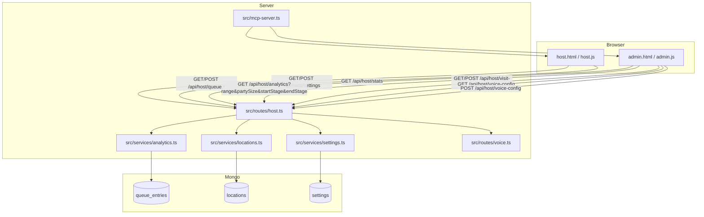

# Feature: Separate Admin View from Host View

Issue: #46  
Owner: GitHub Copilot

## Customer

- Front-desk hosts who need a low-distraction operational surface during service.
- Restaurant managers / owners who need a retrospective workspace to review what happened, adjust guest-entry systems, and improve future service.

## Customer Problem being solved

The current host surface mixes two different jobs:

- **Host-now work**: queue operations, live ETA quoting, seating, chat/call actions, and dining-state movement.
- **Admin-after-the-fact work**: performance review, analytics, visit-page routing, and broader guest-entry channel settings.

That creates two failures:

1. The host screen carries management controls that compete with immediate queue actions.
2. The manager has no first-class workspace for retrospective analysis and system-level tuning.

Issue #46 is not asking for new restaurant capabilities as much as it is asking for product separation. Host should stay focused on what the restaurant needs to do now. Admin should become the place to review what happened and improve future operations.

## User Experience that will solve the problem

1. A host opens `/r/:loc/host.html` and lands in a workspace optimized for active service.
2. The host sees only live operational context:
   - waiting count
   - dining count
   - oldest wait
   - ETA mode and turn-time controls
   - waiting / seated / complete tabs
   - existing queue and dining row actions
3. The host does **not** see admin cards for shift analytics, visit-page routing, or IVR/system settings.
4. If the host or manager needs broader review/configuration, they click `Open Admin`.
5. The user lands on `/r/:loc/admin.html` in a separate workspace that is optimized for retrospective review and future improvement.
6. Admin shows:
   - service overview and today's stats
   - stage-based analytics where the manager chooses a lifecycle start stage and end stage
   - party-size filters and date-range filters
   - visit-page / QR routing settings
   - IVR / phone-system settings
7. The manager uses Admin to answer questions like:
   - How long are parties spending between `ordered` and `served`?
   - Did large parties have much longer waits than parties of 2?
   - Should QR routing stay on `auto` or switch to `menu` or `closed`?
   - Should IVR routing or front-desk transfer behavior change?
8. The manager clicks `Back to Host` to return to the live operational workspace.

## Technical Details

### Architecture overview

This feature is a UI and routing split across existing host-authenticated capabilities. It introduces one new page and one new client script, plus a modest analytics API extension.



### Existing code seams this design uses

- `public/host.html` and `public/host.js` already implement the live queue, dining tabs, ETA mode, and manual turn-time controls.
- `public/analytics.html` and `public/analytics.js` already implement histogram-style analytics with range and party-size filters.
- `src/routes/host.ts` already exposes host, stats, analytics, settings, and visit-config endpoints.
- `src/routes/voice.ts` and the related voice templates already implement IVR behavior behind `/r/:loc/api/voice/*`.

The design should reuse these seams rather than inventing a new backend boundary.

### UI changes

#### New files

| File | Change |
|---|---|
| `public/admin.html` | New Admin workspace shell. Hosts retrospective analytics, stats, visit-page / QR settings, IVR / phone settings, and back-navigation to Host. |
| `public/admin.js` | New Admin client controller. Loads stats, analytics, visit config, and voice config; manages filters; persists last workspace; renders section-level errors. |

#### Modified files

| File | Change |
|---|---|
| `public/host.html` | Remove the `stats-card` and `visit-card` sections; keep ETA mode and turn-time controls in the top bar; replace `Analytics` nav link with `Open Admin`. |
| `public/host.js` | Stop fetching and rendering stats-card and visit-config on Host load; keep `refreshSettings()` for ETA mode / manual turn time; add workspace navigation and local persistence for `lastWorkspace`. |
| `public/analytics.html` | Either remove from navigation or convert into an internal include/reference page during migration. Final user-facing destination becomes `admin.html`. |
| `public/analytics.js` | Refactor reusable histogram rendering helpers into `admin.js` or a shared client utility; extend request shape for `startStage` and `endStage`. |
| `public/styles.css` | Add Admin workspace layout styles and preserve Host's leaner, operational layout. |
| `src/mcp-server.ts` | Serve the new `admin.html` asset under `/r/:loc/admin.html`; optionally keep `analytics.html` for backward compatibility but no longer surface it as primary navigation. |

### Page architecture

#### Host page responsibilities

Host remains the operational workspace and owns:

- login/unlock flow for host-authenticated pages
- queue tabs and actions
- dining and completed tabs
- ETA mode selector
- manual turn-time input
- settings persistence for ETA controls
- link to Admin

Host no longer owns:

- today's stats card UI
- visit-page admin UI
- analytics page navigation as a first-class destination
- IVR/system configuration UI

#### Admin page responsibilities

Admin becomes the retrospective and configuration workspace and owns:

- login/unlock flow when directly entering `admin.html`
- service overview / today's stats rendering
- stage-based analytics rendering
- date range and party-size filtering
- lifecycle start/end stage selection
- visit-page configuration UI
- IVR / phone-system configuration UI
- back-navigation to Host

### Authentication and workspace routing

Current auth is a shared `skb_host` cookie minted by `POST /host/login`. This design keeps that model.

#### Proposed behavior

1. `host.html` and `admin.html` both use the same host-authenticated API surface.
2. Both pages present a destination-specific login shell when `GET /api/host/queue` or a lightweight auth probe returns `401`.
3. Both pages POST to the existing `/r/:loc/api/host/login` endpoint.
4. On success, the page stays on its current destination.
5. Both pages POST to `/r/:loc/api/host/logout`, which clears the shared cookie.
6. The browser stores `localStorage['skb:lastWorkspace:<loc>'] = 'host' | 'admin'` whenever the user changes workspaces.
7. Direct URL entry wins over stored preference. Stored preference only matters for neutral entry points or after login redirects within the same destination.

No backend auth changes are required for v1.

### API surface changes

#### 1. Extend analytics endpoint for lifecycle stage ranges

Current endpoint:

- `GET /r/:loc/api/host/analytics?range=7&partySize=all`

Proposed endpoint:

- `GET /r/:loc/api/host/analytics?range=7&partySize=3-4&startStage=ordered&endStage=served`

New query params:

| Param | Type | Required | Notes |
|---|---|---|---|
| `startStage` | enum | No | Defaults to existing built-in phase behavior when omitted. |
| `endStage` | enum | No | Must represent a stage after `startStage`. |

Allowed stage values:

- `joined`
- `seated`
- `ordered`
- `served`
- `checkout`
- `departed`

Validation rules:

- If one of `startStage` / `endStage` is provided, both must be provided.
- The pair must be a forward-moving lifecycle pair.
- Invalid pairs return `400` with a field-specific error.

Response shape change:

```typescript
interface AnalyticsDTO {
    histograms: PhaseHistogram[];
    dateRange: { from: string; to: string };
    partySizeFilter: string;
    totalParties: number;
    selectedRange?: {
        startStage: AnalyticsStage;
        endStage: AnalyticsStage;
        label: string;
    };
}
```

Behavior:

- When no stage pair is supplied, preserve today's histograms for backward compatibility.
- When a stage pair is supplied, prepend or replace the primary histogram set with a computed range based on the supplied fields.

#### 2. Add explicit IVR configuration endpoints

The current code has IVR runtime routes but no host-authenticated admin endpoint for reading or updating voice-related settings. The technical design therefore needs a thin admin-facing configuration surface.

Proposed endpoints:

- `GET /r/:loc/api/host/voice-config`
- `POST /r/:loc/api/host/voice-config`

Initial config scope for v1:

```typescript
interface VoiceConfigDTO {
    enabled: boolean;
    frontDeskPhone: string;
    largePartyThreshold: number;
}
```

Rationale:

- `frontDeskPhone` already exists on `Location` and is used by voice transfer flow.
- `enabled` maps to whether the restaurant intends IVR participation for that location, even if global env gating still exists.
- `largePartyThreshold` makes the current `> 10` transfer behavior configurable instead of hard-coded.

Storage choice:

- Persist location-level voice config on the `locations` document, alongside other tenant-level guest-entry settings.

Validation:

- `frontDeskPhone` must be a 10-digit US number when present.
- `largePartyThreshold` must be an integer in a bounded range such as `6..20`.

#### 3. Reuse existing visit-config endpoints unchanged

Existing endpoints are already correctly shaped for Admin:

- `GET /r/:loc/api/host/visit-config`
- `POST /r/:loc/api/host/visit-config`

No server contract changes are required.

#### 4. Reuse existing settings endpoints for Host ETA controls

Existing Host endpoints stay in Host:

- `GET /r/:loc/api/host/settings`
- `POST /r/:loc/api/host/settings`

Admin must not become the primary editor for these fields.

### Data model / schema changes

#### `Location` additions

Current `Location` already stores `visitMode`, `menuUrl`, `closedMessage`, and `frontDeskPhone`. This RFC proposes extending the location document with explicit voice-config fields.

```typescript
interface Location {
    _id: string;
    name: string;
    pin: string;
    frontDeskPhone?: string;
    visitMode?: 'auto' | 'queue' | 'menu' | 'closed';
    menuUrl?: string;
    closedMessage?: string;
    voiceEnabled?: boolean;
    voiceLargePartyThreshold?: number;
}
```

Migration:

- No blocking migration required.
- Missing `voiceEnabled` defaults from environment/runtime availability.
- Missing `voiceLargePartyThreshold` defaults to current behavior `10`.

#### Analytics stage mapping

No schema changes are needed for stage-range analytics because the relevant lifecycle timestamps already exist on `queue_entries`:

- `joinedAt`
- `seatedAt`
- `orderedAt`
- `servedAt`
- `checkoutAt`
- `departedAt`

The change is query composition, not storage.

### Analytics service changes

`src/services/analytics.ts` currently has a fixed `PHASES` array that maps known histogram pairs.

Proposed refactor:

1. Introduce `AnalyticsStage` enum-like typing.
2. Introduce a stage-to-field map:

```typescript
const STAGE_FIELDS = {
    joined: 'joinedAt',
    seated: 'seatedAt',
    ordered: 'orderedAt',
    served: 'servedAt',
    checkout: 'checkoutAt',
    departed: 'departedAt',
} as const;
```

3. Add validation helper for legal stage pairs.
4. Extend `getAnalytics(locationId, rangeDays, partySizeFilter, startStage?, endStage?)`.
5. Reuse existing histogram generation by computing durations from the selected field pair.
6. Preserve existing phase histograms for backward compatibility and regression safety.

This is low technical uncertainty because the current analytics service already computes duration histograms from start/end fields. The new feature generalizes an existing pattern.

### Failure modes & timeouts

| Area | Failure mode | Handling |
|---|---|---|
| Admin page load | `/host/stats` fails | Render stats section error without blocking analytics or config sections |
| Admin analytics | invalid `startStage` / `endStage` | `400` with field error; client preserves prior graph and surfaces inline validation |
| Admin visit config | location update validation fails | Existing `400` errors displayed inline in Admin |
| Admin voice config | invalid phone or threshold | `400` with field-level error |
| Host page | admin-only endpoint unavailable | No effect; Host must not fetch it during initial load |
| Shared auth | stale cookie | Both pages fall back to their own login shell |

No new long-running operation is introduced. Existing HTTP request behavior remains short-lived and synchronous.

### Telemetry & analytics

Add or preserve structured logs for:

- `host.workspace.open` with `workspace: host|admin` and `loc`
- `admin.analytics.query` with `range`, `partySize`, `startStage`, `endStage`, `totalParties`
- `host.visit_config.updated` (already exists)
- `host.voice_config.updated` (new)
- `host.settings.updated` or equivalent for ETA mode / turn-time changes if not already logged explicitly

These logs are sufficient for v1 observability without introducing a separate telemetry pipeline.

## Confidence Level

90

The codebase already has nearly all required primitives: shared host auth, separated host routes, analytics service with duration histograms, visit-config persistence, and IVR runtime flows. The only material backend additions are a small analytics generalization and a thin voice-config admin API.

## Validation Plan

| User Scenario | Expected outcome | Validation method |
|---|---|---|
| Host opens Host workspace | Host sees queue tabs plus ETA controls, but not stats/visit/IVR admin sections | UI validation |
| User switches Host → Admin | Admin opens without re-authentication using the same cookie | UI validation |
| Direct entry to Admin while logged out | Admin login shell appears and returns to `admin.html` on success | UI validation |
| Admin requests analytics for `ordered → served`, party size `3-4` | API returns histogram for that stage pair and slice | API validation |
| Admin updates visit-page routing | Updated values persist and subsequent read returns them | API validation + database validation |
| Admin updates IVR config | New voice-config endpoint validates and persists the changes | API validation + database validation |
| Host changes ETA mode or turn time | Host settings persist and queue ETA behavior remains unchanged | UI validation + API validation |
| Host loads on phone-width viewport | Waitlist renders promptly without admin-only fetch dependencies | UI validation |

## Test Matrix

### Unit

- Add analytics unit coverage for stage-pair validation and histogram field mapping.
- Add tests for legal and illegal lifecycle pairs such as:
  - `joined -> seated` valid
  - `ordered -> served` valid
  - `served -> ordered` invalid
  - `joined -> joined` invalid
- Add voice-config validation tests for `frontDeskPhone`, `voiceEnabled`, and `largePartyThreshold`.
- Modify settings-related unit coverage only if Host workspace persistence helpers are extracted into client utilities.

### Integration

- Extend host integration tests to validate `GET /host/analytics` with `startStage` / `endStage`.
- Add integration tests for `GET/POST /host/voice-config`.
- Add integration tests that verify `admin.html`-backed API usage still shares the same auth cookie as Host endpoints.
- Modify existing host settings integration coverage to ensure Host-owned ETA controls remain unchanged.

### E2E

- Add one E2E flow for workspace separation:
  - login to Host
  - verify ETA controls are present and stats/visit cards are absent
  - click `Open Admin`
  - verify Admin shows stats, analytics controls, visit settings, and voice settings

No external Twilio integration change is required for this issue, so a single browser E2E is sufficient.

## Risks & Mitigations

| Risk | Impact | Mitigation |
|---|---|---|
| Analytics extension breaks existing charts | Admin analytics regressions | Preserve backward-compatible default behavior when `startStage`/`endStage` are omitted |
| Host page accidentally still depends on stats/visit fetches | Slower Host load and mixed responsibilities remain | Remove those code paths from `host.js` and add regression test coverage |
| Voice configuration scope balloons into full IVR redesign | Delays issue 46 | Limit v1 to a thin admin config layer over existing voice behavior |
| Shared auth across two pages causes confusing redirect behavior | Users land on wrong workspace | Keep direct URL precedence and persist last workspace only as a soft preference |
| Admin becomes too live/operational again | Product intent drifts | Keep Admin sections oriented around review, configuration, and future improvement rather than queue actions |

## Observability (logs, metrics, alerts)

- Reuse structured JSON logs in existing route style.
- Add logs for Admin analytics queries including selected lifecycle range.
- Add logs for Admin voice-config writes and read failures.
- Watch for:
  - increased `400` rates on analytics query validation
  - increased `401` rates after workspace switching
  - unexpected Host-side fetches to admin-only endpoints in browser logs during manual validation

## Architecture Analysis

### Patterns Correctly Followed

- Static HTML/JS pages per workspace under `public/` with API-backed rendering.
- Shared host-auth cookie protecting all management routes under `src/routes/host.ts`.
- Service-layer business logic in `src/services/*` with route files remaining thin.
- Tenant-level configuration living on location documents for visit-related behavior.

### Patterns Missing from Architecture

- There is no project-specific architecture document configured in FRAIM, so this RFC uses generic architecture standards plus codebase pattern discovery.
- Workspace separation between operational UI and retrospective/configuration UI exists conceptually in the product direction but is not yet documented as a first-class pattern. This RFC establishes that pattern.

### Patterns Incorrectly Followed

- Host currently violates the intended separation-of-concerns pattern by embedding both live queue operations and retrospective/configuration panels in one page.
- Analytics currently exists as a separate destination, but not as part of a coherent Admin workspace. The design fixes that by grouping retrospective and system-configuration functions together.